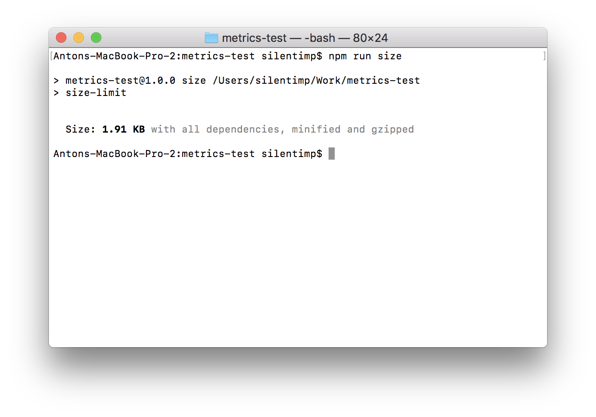
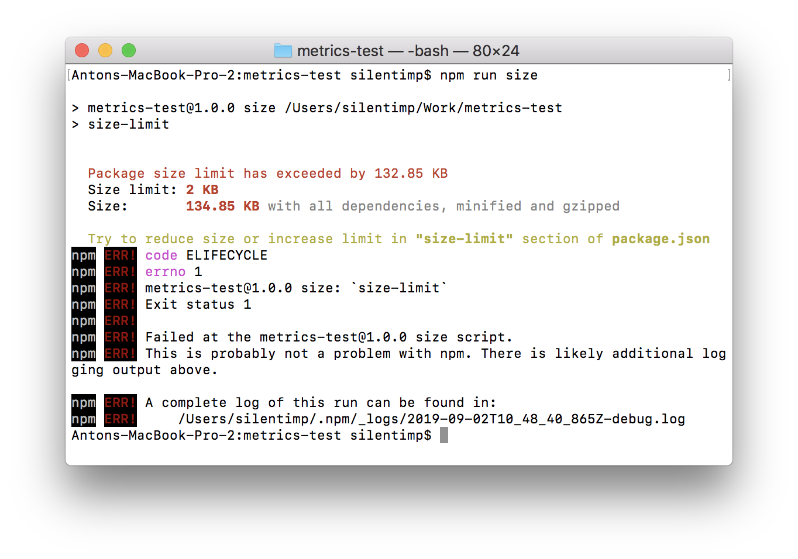
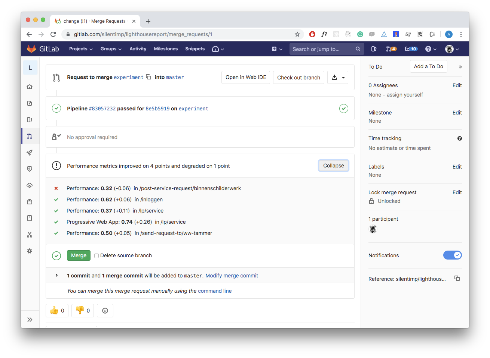
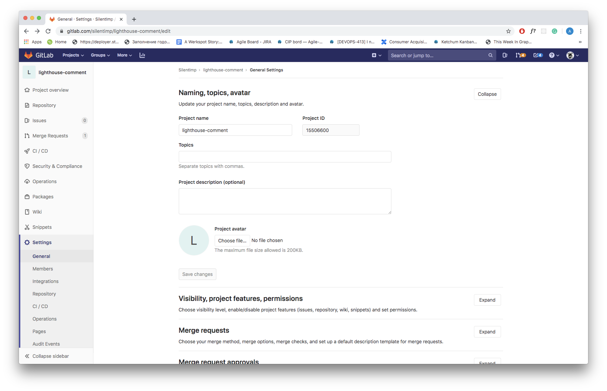
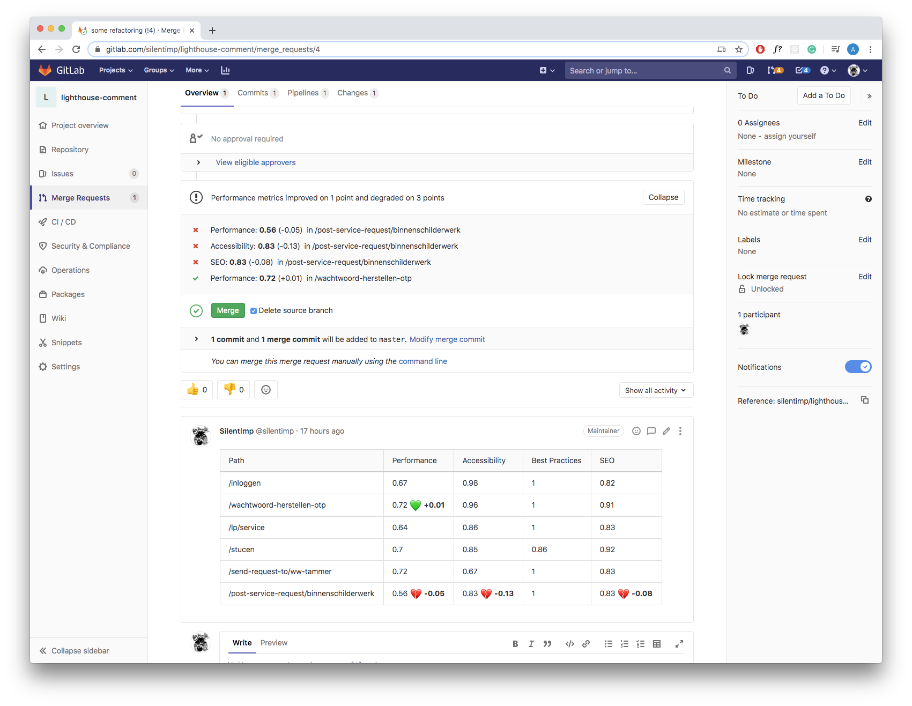

[TOC]

# Как сделать производительность видимой с использованием синтетических тестов, GitLab CI и худу GitLab артефактов

Мы можем оптимизировать приложение так, что его запуск будет казаться мгновенным и 60fps во время его работы — абсолютными минимумом. Однако пройдет месяц, пол года, десять фич, лунное затмение, семь сендвичей с тунцом и от выстраданного быстродействия не останется и следа. Код склонен к деградации. Примите этот факт как весьма огорчительную данность. 

Что же делать? Смириться и перестать заботиться о производительности? Это не выход. Производительность это конкурентное преимущество, которое приводит и удерживает клиентов. Регулярно повторять процедуру? Это дорого. И сложно. А значит, несмотря на все достоинства производительного приложения с точки зрения бизнеса, вряд ли окупится. 

Первый шаг к решению любой проблемы — сделать её видимой. И именно об этом я и хочу поговорить. 

## Методы формирования бюджета производительности проекта

Первый вопрос, на который следует ответить: что именно вы подразумеваете под производительным проектом? Какие метрики вы используете? Какая величина этих метрик будет для вас приемлемой? Выбор метрик выходит за рамки этой статьи и в значительной мере зависит от бизнес-задач и конкретных особенностей проекта, но начать я рекоммендую с прочтения статьи «[Пользователе-центрические метрики производительности](https://developers.google.com/web/fundamentals/performance/user-centric-performance-metrics)» [Филипа Валтона](https://developers.google.com/web/resources/contributors/philipwalton). 

Самые простые способы определения нужных вам значений метрик: соревноваться с конкурентами или с самим собой. Кроме того, иногда, могут быть полезными инструменты вроде https://www.performancebudget.io/


### Используйте конкурентов себе во благо

Если вам случалось когда-нибудь удирать от экстатически возбужденного медведя, то вы знаете, что вам вовсе не обязательно быть олимпийским чемпионом по бегу, что бы выпутаться из этой неприятности. Достаточно быть всего-навсего чуточку быстрее, чем ваш товарищ по несчастью. 

Составьте список конкурентов. Если это однотипные проекты, то, обычно, они состоят из подобных друг другу типов страниц. К примеру, в интернет магазине это могут быть: страница со списком товаров, страница товара, корзина, чекаут и т.д. 

1. Замеряем значение выбранных метрик на каждой из однотипных страниц у каждого из конкурентов. 

2. Затем замеряем их в нашем проекте. 

3. Находим для каждой метрики ближайшее к ней лучшее значение у конкурента, увеличиваем его на 20% и устанавливаем в качестве целевого. 

Почему на 20%? Это магическое число, которое, якобы, должно означать, что разница будет заметна невооруженным глазом. Естественно, это в лучшем случае полуправда, но почему бы, собственно, и нет? Нам нужно какое то значение, от которого мы могли бы оттолкнуться — вот оно, перед вами. Если вы, впоследствии, поймете, что его следует скорректировать по каким либо причинам связанным с контекстом проекта и его характерными особенностями — сделайте это.

### Бой с тенью

Ваш проект уникален? У него нет конкурентов на рынке? Вы уже лучше любого из них? Не беда. Всегда можно соревноваться с единственным достойным соперником — с собой. Сделайте замеры значений каждой из метрик производительности проекта на каждой типовой странице и сделайте своей целью увеличить их на те же самые 20%.


## Синтетические тесты

Есть два способа измерения производительности: синтетический, который производится в контролируемом окружении и ром (от RUM — real user measurements), при котором данные о производительности собираются у реальных пользователей проекта.

Возьмем за основу синтетические тесты и предположим, что в проекте используется GitLab, а сборка проекта происходит на базе встроенной в него системе CI.

### Библиотека и её размер в качестве метрики

Допустим, вы решили разработать библиотеку и опубликовать её в npm.  Вам бы хотелось, чтобы её выбирали среди аналогичных библиотек так как она значительно меньше прочих а, значит, её использование в меньшей степени утяжелит проект.  Что, в свою очередь, сбережет клиентам трафик, который часто может быть платным и позволит проекту загрузиться быстрее, что весьма важно в условиях растущего процента пользователей использующих мобильные устройства и медленное соединение. 

#### Пакет для измерения размера библиотеки

Чтобы сохранить размер библиотеки минимально возможным нам следует контролировать его изменения. Но как это сделать? В этом нам поможет пакет [Size Limit](https://github.com/ai/size-limit/).

Установим его:

```bash
npm i -D size-limit/preset-small-lib
```

Затем добавим в `package.json`

```diff
"scripts": {
+ "size": "size-limit",
  "test": "jest && eslint ."
},
+ "size-limit": [
+   {
+     "path": "index.js"
+   }
+ ],
```

Блок `"size-limit":[{},{},…]` содержит список файлов, размер которых мы хотим проверить. В нашем случае файл только один — `index.js`.

Что касается npm-скрипта `size`, то он просто запускает пакет `size-limit`, который считывает упомянутый выше конфигурационный блок `"size-limit"` из `package.json` и проверяет размер указанных в нем файлов. Запустим его и посмотрим что получится:

```bash
npm run size
```



Теперь мы видим размер файла, но он никак не контролируется. Добавим `limit` в `package.json`:

```diff
"size-limit": [
  {
+   "limit": "2 KB",
    "path": "index.js"
  }
],
```

И теперь, если мы снова запустим скрипт он будет оценивать размер файла относительно установленного нами лимита.


В случае если проверяемый файл не проходит лимит по размеру, то он завершится с ненулевым кодом. Это, помимо прочего, значит, что он может остановить пайплайн GitLab CI. И мы это можем использовать.



Теперь мы можем, к примеру, использовать хуки, что бы запускать проверку перед каждым коммитом … но всегда останется `git rebase -i HEAD~1`, который, не вызовет `pre-commit` хук, или, к примеру, ключик `--no-verify`. И все попытки предотвратить увеличение размера пропадут втуне. 

Кроме того, нам в принципе не следует делать проверку блокирующей. Почему? В проект со временем добавляются новые фичи. Каждая будет влиять на вес. Это нормально. Наша задача не зафиксировать один размер на веки вечные, а сделать изменение размера видимым. Чтобы не допустить случайного увеличения размера за счет ненужной библиотеки или непродуманного импорта. Что бы разработчик и продукт-овнер видел сколько «стоит» фича в контексте производительности. И, возможно, задумались — а стоит ли она этого, а нельзя ли использовать для её реализации другой пакет? Благо https://bundlephobia.com/ позволяет найти аналоги для практически чего угодно.

Так как же нам следует поступить? Давайте отобразим изменения размера прямо в мердж-реквесте! Вы ведь не пушите в мастер, а следуете заветам git-flow в одном из множества его вариаций, как настоящие взрослые разработчики, правда?

#### Запуск проверки в GitLab CI

Давайте переместим проверку размера скрипта в пайплайн. Для этого создадим конфигурационный файл `.gitlab-ci.yml`.

```yaml
image: node:latest

stages:
  - performance

sizecheck:
  stage: performance
  before_script:
    - npm ci
  script:
    - npm run size

```

Что мы сделали в этом файле:

1. `image: node:latest` — загрузили образ системы с последней доступной lts node. Нужные образы для большинства нужд можно найти тут: https://hub.docker.com/.

2. ```yaml
   stages:
     - performance
   ```
   Создали в пайплайне шаг `performance`.
   
3. ```yaml
   sizecheck:
     stage: performance
   ```
   Создали операцию `sizecheck`, которая будет выполняться на шаге `performance`.
4. ```yaml
    before_script:
      - npm ci
    script:
      - npm run size
    ```
   Установили все пакеты, провели сборку/транспайлинг, если это нужно, а затем — запустили проверку размера скрипта.
   

Теперь каждый раз, когда создается мердж-реквест будет запускаться пайплайн с единственным шагом `performance` на котором будет запускаться единственная операция `sizecheck`. В случае, если бы проверка не была бы пройдена скрипт завершился бы с ненулевым кодом и это остановило бы пайплайн, так что мердж бы не произошел. Но, что бы понять, что произошло пришлось бы сначала открывать пайплайн, потом изучать вывод нужной операции. И результат был бы блокирующим. Так как мы не могли бы смерджить ветку, даже если это было бы осознанное решение. Мы можем лучше.

#### Худу артефактов GitLab

Давайте добавим [GitLab артефакт](https://docs.gitlab.com/ee/ci/yaml/README.html#artifacts) типа [metrics](https://docs.gitlab.com/ee/ci/yaml/README.html#artifactsreportsmetrics-premium). Артефакт это файл, который остается «жив», после завершения операции в пайплайне. Конкретно этот тип артефакта позволяет отображать в мердж-реквесте изменение выбранной величины между артефактами в `master` и ветка, из которой сделан мердж-реквест. `metrics` тип имеет [текстовый формат `prometeus`](https://prometheus.io/docs/instrumenting/exposition_formats/). Для GitLab значение сохраненное в артефакте это просто текст. Он не понимает как именно изменилось значение, знает только то, что оно другое. 
Итак, что нам всё-таки надо сделать?

1. Объявить артефакт в пайплайне. 
2. Изменить скрипт так, чтобы сформировать в пайплайне артефакт.

Что бы создать артефакт нужно изменить `.gitlab-ci.yml` следующим образом:

```diff
image: node:latest

stages:
  - performance

sizecheck:
  stage: performance
  before_script:
    - npm ci
  script:
    - npm run size
+  artifacts:
+    expire_in: 7 days
+    paths:
+      - metric.txt
+    reports:
+      metrics: metric.txt
```

1. `expire_in: 7 days` — aртефакт будет существовать в течении семи дней.  

2. ```yaml
   paths:
     - metric.txt
   ```
   Он будет сохранен в корневом директорие

3. ```yaml
   reports:
     metrics: metric.txt
   ```
   Артефакт будет иметь особый тип `reports:metrics`

Теперь давайте заставим Size Limit сгенерировать отчет. Для этого изменим `package.json`:

```diff
"scripts": {
-  "size": "size-limit",
+  "size": "size-limit --json > size-limit.json",
  "test": "jest && eslint ."
},
```

`size-limit` c ключем `--json` выводит данные в формате json. Вот так:


А перенаправление `> size-limit.json` сохраняет json в файл `size-limit.json`.

Теперь нужно из этого файла сформировать артефакт. Формат сводится к `[имя метрики][пробел][значение метрики]`. Создадим скрипт `generate-metric.js`: 

```javascript
const report = require('./size-limit.json');
process.stdout.write(`size ${(report[0].size/1024).toFixed(1)}Kb`);
process.exit(0);
```

И добавим его в `package.json`:

```diff
"scripts": {
  "size": "size-limit --json > size-limit.json",
+  "postsize": "node generate-metric.js > metric.txt",
  "test": "jest && eslint ."
},
```

Так как мы добавили префикс `post` то команда `npm run size` сначала запустит скрипта `size`, а затем, автоматически, выполнить скрипт `postsize`, результатом работы которого станет файл `metric.txt`, который будет использован в качестве артефакта.

И в результате, когда мы вмерджим это в мастер, а потом внесем какие то изменения и создадим новый мердж-реквест, то увидим следующее:


В появившемся блоке сначала идет название метрики — `size`, затем размер метрики в фичер-бранче, а в скобках — размер в `master`.

Вот теперь мы действительно легко и без лишних телодвижений видим как изменился размер пакета и можем решить — вмерджить или нет.

#### Резюме

Ну вот. С тривиальным случаем разобрались. Если файлов много, в артефакте значения разделяйте переводом строки. Как альтернативу Size Limit можно рассмотреть [bundlesize](https://www.npmjs.com/package/bundlesize). Если сборка проводится с помощью WebPack, то можно получить все нужные размеры запустив сборку следующим образом:

```bash
webpack --profile --json > stats.json
```

В случае, когда используется next.js, можно, к примеру, использовать плагин [@next/bundle-analyzer](https://www.npmjs.com/package/@zeit/next-bundle-analyzer). Впрочем, он доступен и для webpack: [webpack-bundle-analyzer](https://www.npmjs.com/package/@next/bundle-analyzer).

### Используем lighthouse

Lighthouse это стандарт де факто в области аналитики проекта. Давайте напишем скрипт, который позволит нам замерять очки производительности, доступности, использования рекоммендованных подходов и оптимизации для поисковых машин. 

#### Скрипт, который позволит делать замеры

Для начала нам понадобится установить пакеты [lighthouse](https://www.npmjs.com/package/lighthouse), который будет делать замеры и [puppeteer](https://www.npmjs.com/package/puppeteer), который мы будем использовать в качестве headeless-браузера. 

```bash
npm i -D lighthouse puppeteer
```

После чего создадим скрипт `lighthouse.js` и запустим браузер браузер:

```javascript
const puppeteer = require('puppeteer');

(async () => {
  const browser = await puppeteer.launch({
    args: ['--no-sandbox', '--disable-setuid-sandbox', '--headless'],
  });
})();
```

А теперь напишем функцию, которая позволит проанализировать url:

```javascript
const lighthouse = require('lighthouse');

const DOMAIN = process.env.DOMAIN;

const buildReport = browser => async url => {
  const data = await lighthouse(
    `${DOMAIN}${url}`,
    {
      port: new URL(browser.wsEndpoint()).port,
      output: 'json',
    },
    {
      extends: 'lighthouse:full',
    }
  );
  const { report: reportJSON } = data;
  const report = JSON.parse(reportJSON);
  // …
}
```

Отлично, у нас есть функция, которая принимает в качестве аргумента объект браузера и возвращает функцию, которая принимает в качестве аргумента `url` и передав его `lighthouse` получает отчет с результатами. Аргументы которые мы передает `lighthouse` : 

1. Адрес, который анализируем.
2. Настройки `lighthouse`, в частности `port`, на котором поднят браузер и `output` — формат, в котором будет сгенерирован отчет.
3. Настройки отчета. `lighthouse:full` — всё, что только можно. Для более тонкой настройки следует обратиться к [документации](https://github.com/GoogleChrome/lighthouse/blob/master/docs/configuration.md).

Чудесно, у нас есть отчет. Но что с ним сделать? Можно проанализировать какие то из метрик и завершить работу скрипта с ненулевым кодом, что завершит остановит пайплайн: 

```javascript
if (report.categories.performance.score < 0.8) process.exit(1);
```

Но мы же хотим сделать производительность видимой и неблокирующей? Тогда давайте используем ещё один тип артефактов: [GitLab performance artifact](https://docs.gitlab.com/ee/ci/yaml/README.html#artifactsreportsperformance-premium).

#### Артефакты производительности  GitLab

Формат этого артефакта … ох, что бы в нем разобраться мне пришлось изучить код плагина написанного для [sitespeed.io](https://gitlab.com/gitlab-org/gl-performance). Вопрос о том, почему нельзя внятно описать формат для каждого из артефактов в документации GitLab, к моему искреннему сожалению, остается открытым.

```json
[
  {
		"subject":"/",
    "metrics":[
      {
        "name":"Transfer Size (KB)",
        "value":"19.5",
        "desiredSize":"smaller"
      },
      {
        "name":"Total Score",
        "value":92,
        "desiredSize":"larger"
      },
      {…}
    ]
	},
  {…}
]
```

Артефакт это файл в формате `json`, который содержит массив объектов, каждый из которых представляет собой отчет о странице. 

```json
[{страница 1}, {страница 2}, …]
```

Каждая страница представляет собой объект, содержащий свойства: 

1. `subject` — это идентификатор страницы и для него удобно использовать часть url — путь. 
2. `metrics` — массив объектов, каждый из которых представляет собой одно измерение, сделанное на странице.

```json
{
  "subject":"/login/",
  "metrics":[{измерение 1}, {измерение 2}, {измерение 3}, …]
}
```

Измерение это объект, содержащий свойства:

1. `name` — имя измерения. Например, это может быть `Time to first byte` или `Time to interactive`.
2. `value` — числовой результат измерения.
3. `desiredSize` — если целевое значение должно быть минимально, как, например, в случае `Time to interactive`, то его значение должно быть `smaller`, если максимально, как в случае метрики `Performance score` используемой `lighthouse` — `larger`.

```json
{
  "name":"Time to first byte (ms)",
  "value":240,
  "desiredSize":"smaller"
}
```

Давайте допишем функцию `buildReport` таким образом, чтобы она возвращала отчет для одной страницы, а в качестве метрик используем стандартные для `lighthouse`.


```javascript
const buildReport = browser => async url => {
  // …
  
  const metrics = [
    {
      name: report.categories.performance.title,
      value: report.categories.performance.score,
      desiredSize: 'larger',
    },
    {
      name: report.categories.accessibility.title,
      value: report.categories.accessibility.score,
      desiredSize: 'larger',
    },
    {
      name: report.categories['best-practices'].title,
      value: report.categories['best-practices'].score,
      desiredSize: 'larger',
    },
    {
      name: report.categories.seo.title,
      value: report.categories.seo.score,
      desiredSize: 'larger',
    },
    {
      name: report.categories.pwa.title,
      value: report.categories.pwa.score,
      desiredSize: 'larger',
    },
  ];
  return {
    subject: url,
    metrics: metrics,
  };
}
```

Теперь, когда у нас есть функция, формирующая отчет, — применим её на практике к каждой из типовых страниц проекта. Следует сразу оговориться, что `process.env.DOMAIN` должен содержать домен стейджинга, на который предварительно должен быть задэплоен проект из фичер-бранча. 

```javascript
const fs = require('fs');
const lighthouse = require('lighthouse');
const puppeteer = require('puppeteer');

const DOMAIN = process.env.DOMAIN;

const buildReport = browser => async url => {
  //…
};

const urls = [
  '/inloggen',
  '/wachtwoord-herstellen-otp',
  '/lp/service',
  '/send-request-to/ww-tammer',
  '/post-service-request/binnenschilderwerk',
];

(async () => {
  const browser = await puppeteer.launch({
    args: ['--no-sandbox', '--disable-setuid-sandbox', '--headless'],
  });
  const builder = buildReport(browser);
  const report = [];
  for (let url of urls) {
    const metrics = await builder(url);
    report.push(metrics);
  }
  fs.writeFileSync(`./performance.json`, JSON.stringify(report));
  await browser.close();
})();
```

Возможно к вашему горлу сейчас подступил ком и вам хочется крикнуть «—Зачем ты тратишь наше время, негодник?! Ты, будучи не в состоянии даже применить `Promise.all`, стремишься поучать нас?». В свою защиту я осмелюсь заметить, что [не рекомендуется](https://github.com/GoogleChrome/lighthouse/issues/7187#issuecomment-461838128) запускать более одного экземпляра `lighthouse` одновременно ввиду того, что это пагубно повлияет на точность результатов измерений, а если не проявить должной изобретательности, и вовсе приведет к исключению. 

#### Многопоточность

Вам всё же очень хочется распараллелить процесс? Ну что же, можно использовать [`node cluster`](https://nodejs.org/docs/latest/api/cluster.html), однако это имеет смысл только в случае, если скрипт запускается в окружении с более чем одним доступным ядром процессора. И даже тогда следует иметь ввиду, что так как в каждом форке процесса, ввиду природы `node.js`, у нас в полном объеме будет присутствовать его инстанс, вместо того, что бы переиспользоваться между ними, это соответствующим образом скажется на потребляемой оперативной памяти. Всё это по сути означает, что процесс будет дороже, ввиду новых требований к аппаратному обеспечению, но, да, несколько быстрее и с большей погрешностью. Может статься что овчинка не стоит выделки. Если вы всё же решились, то нам понадобится:

1. Разделить массив url на равные части по количеству ядер.
2. Сделать форки процесса по количеству ядер.
3. Передать в них части массива и после их обработки — вернуть отчеты в основной процесс.

Чтобы разделить массив на равные части можно использовать самые разные подходы, и такая функция, написанная мной за пару минут, вряд ли хуже других:

```javascript 
/**
 * Возвращает массив адресов разделенный на части по количеству ядер
 *
 * @param urls {String[]} — массив url
 * @param cors {Number} — количество доступных ядер
 * @return {Array<String[]>} — массив адресов разделенный на части по количеству ядер
 */
function chunkArray(urls, cors){
    const arrayLength = urls.length;
    const chunkSize = arrayLength/cors;
    const resultLength = arrayLength < cors ? arrayLength : cors;
  	const size = (chunkSize < 1) ? 1 : chunkSize;
    return [...(new Array(resultLength))].map((item, index)=>urls.slice(index, index+size));
}
```

Сделаем форки по количеству ядер:

```javascript
const fs = require('fs');
const lighthouse = require('lighthouse');
const puppeteer = require('puppeteer');

// Добавляем пакеты, что бы использовать кластер
const cluster = require('cluster');
// И узнать количество ядер в ОС. Оба пакета стандартны для node.js.
const numCPUs = require('os').cpus().length;

const DOMAIN = process.env.DOMAIN;

const buildReport = browser => async url => {
  //…
};

function chunkArray(myArray, chunk_size){
  //…
};

const urls = [
  '/inloggen',
  '/wachtwoord-herstellen-otp',
  '/lp/service',
  '/send-request-to/ww-tammer',
  '/post-service-request/binnenschilderwerk',
];

(async () => {
  if (cluster.isMaster) {
    // Родительский процесс
    const chunks = chunkArray(urls, urls.length/numCPUs);
    chunks.map(chunk => {
      // Создаем дочерний процесс
      const worker = cluster.fork();
    });
  } else {
    // Дочерний процесс
  }
})();
```

Передадим в дочерние процессы части массива и отчеты обратно в родительский процес:

```javascript
const fs = require('fs');
const lighthouse = require('lighthouse');
const puppeteer = require('puppeteer');

const cluster = require('cluster');
const numCPUs = require('os').cpus().length;

const DOMAIN = process.env.DOMAIN;

const buildReport = browser => async url => {
  //…
};

function chunkArray(myArray, chunk_size){
  //…
};

const urls = [
  '/inloggen',
  '/wachtwoord-herstellen-otp',
  '/lp/service',
  '/send-request-to/ww-tammer',
  '/post-service-request/binnenschilderwerk',
];

(async () => {
  if (cluster.isMaster) {
    // Родительский процесс
    const chunks = chunkArray(urls, urls.length/numCPUs);
    chunks.map(chunk => {
      const worker = cluster.fork();
      // Отправляем сообщение с url дочернему процессу
      worker.send(chank);
    });
  } else {
    // Дочерний процесс
    // Получаем сообщение от родительского процесса
    process.on('message', async (urls) => {
      const browser = await puppeteer.launch({
        args: ['--no-sandbox', '--disable-setuid-sandbox', '--headless'],
      });
      const builder = buildReport(browser);
      const report = [];
      for (let url of urls) {
        // Генерируем отчет для каждого url
        const metrics = await builder(url);
        report.push(metrics);
      }
      // Отправляем массив с отчетами в родительский процесс
      cluster.worker.send(report);
      await browser.close();
    });
  }
})();
```

И, наконец, сводим данные снова в один массив и генерируем артефакт. 

```javascript
const fs = require('fs');
const lighthouse = require('lighthouse');
const puppeteer = require('puppeteer');

const cluster = require('cluster');
const numCPUs = require('os').cpus().length;

const DOMAIN = process.env.DOMAIN;

const buildReport = browser => async url => {
  //…
};

function chunkArray(myArray, chunk_size){
  //…
};

const urls = [
  '/inloggen',
  '/wachtwoord-herstellen-otp',
  '/lp/service',
  '/send-request-to/ww-tammer',
  '/post-service-request/binnenschilderwerk',
];

(async () => {
  if (cluster.isMaster) {
    // Родительский процесс
    const chunks = chunkArray(urls, urls.length/numCPUs);
    chunks.map(chunk => {
      const worker = cluster.fork();
      worker.send(chank);
    });
    cluster.on('message', (worker, msg) => {
      report = [...report, ...msg];
      worker.disconnect();
      reportsCount++;
      if (reportsCount === chunks.length) {
        console.log('final report: ', report);
        fs.writeFileSync(`./performance.json`, JSON.stringify(report));
        process.exit(0);
      }
    });
  } else {
    // Дочерний процесс
    process.on('message', async (urls) => {
      const browser = await puppeteer.launch({
        args: ['--no-sandbox', '--disable-setuid-sandbox', '--headless'],
      });
      const builder = buildReport(browser);
      const report = [];
      for (let url of urls) {
        const metrics = await builder(url);
        report.push(metrics);
      }
      cluster.worker.send(report);
      await browser.close();
    });
  }
})();
```

#### Точность измерений

Хорошо, у нас есть многопоточность, которая увеличила и без того прискорбно большую погрешность измерений `lighthouse`. Как нам её уменьшить? Cделать несколько замеров и усреднить. 

```javascript
const fs = require('fs');
const lighthouse = require('lighthouse');
const puppeteer = require('puppeteer');

const cluster = require('cluster');
const numCPUs = require('os').cpus().length;

const DOMAIN = process.env.DOMAIN;

const buildReport = browser => async url => {
  //…
};

function chunkArray(myArray, chunk_size){
  //…
};

const urls = [
  '/inloggen',
  '/wachtwoord-herstellen-otp',
  '/lp/service',
  '/send-request-to/ww-tammer',
  '/post-service-request/binnenschilderwerk',
];

// Количество замеров, которое мы хотим сделать
const MEASURES_COUNT = 3;

/**
 * Редьюсер, который усреднит значения всех измерений для страницы
 * @param pages {Object} — аккумулятор
 * @param page {Object} — страница
 * @param page {Object} — страница с усредненными значениями
 */
const mergeMetrics = (pages, page) => {
  if (!pages) return page;
  return {
    subject: pages.subject,
    metrics: pages.metrics.map((measure, index) => {
      let value = (measure.value + page.metrics[index].value)/2;
      value = +value.toFixed(2);
      return {
        ...measure,
        value,
      }
    }),
  }
}

(async () => {
  if (cluster.isMaster) {
    const arrays = chunkArray(urls, urls.length/numCPUs);
    let report = [];
    let reportsCount = 0;
    arrays.map(chank => {
      const worker = cluster.fork();
      worker.send(chank);
    });
    cluster.on('message', (worker, msg) => {
      report = [...report, ...msg];
      worker.disconnect();
      reportsCount++;
      if (reportsCount === arrays.length) {
        fs.writeFileSync(`./performance.json`, JSON.stringify(report));
        process.exit(0);
      }
    })
  } else {
    process.on('message', async (urls) => {
      const browser = await puppeteer.launch({
        args: ['--no-sandbox', '--disable-setuid-sandbox', '--headless'],
      });
      const builder = buildReport(browser);
      const report = [];
      for (let url of urls) {
        // Сделаем количество замеров, которое задали в MEASURES_COUNT и усредним
        let measures = [];
        let index = MEASURES_COUNT;
        while(index--){
          const metric = await builder(url);
          measures.push(metric);
        }
        const measure = measures.reduce(mergeMetrics);
        report.push(measure);
      }
      cluster.worker.send(report);
      await browser.close();
    });
  }
})();
```

Ну а теперь добавим `lighthouse` в пайплайн.

#### Добавляем его в пайплайн

Создадим конфигурационный файл `.gitlab-ci.yml`.

```yaml
image: node:latest

stages:
	# Вам нужно сделать дейплой на staging и поместить домен стейджинга в переменную окружения DOMAIN. Но это выходит за рамки этой статьи, прежде всего потому, что очень сильно зависит от вашего конкретного проекта. 
	# - deploy
	- performance
	
lighthouse:
	stage: performance
  before_script:
    - apt-get update
    - apt-get -y install gconf-service libasound2 libatk1.0-0 libatk-bridge2.0-0 libc6 libcairo2 libcups2 libdbus-1-3 libexpat1 libfontconfig1 libgcc1 libgconf-2-4 libgdk-pixbuf2.0-0 libglib2.0-0 libgtk-3-0 libnspr4 libpango-1.0-0 libpangocairo-1.0-0 libstdc++6 libx11-6 libx11-xcb1 libxcb1 libxcomposite1 libxcursor1 libxdamage1 libxext6 libxfixes3 libxi6 libxrandr2 libxrender1 libxss1 libxtst6 ca-certificates fonts-liberation libappindicator1 libnss3 lsb-release xdg-utils wget
    - npm ci
  script:
	  - node lighthouse.js
	artifacts:
    expire_in: 7 days
    paths:
    	- performance.json
    reports:
    	performance: performance.json
```

Множество пакетов, которое мы устанавливаем, нужны для работы `puppeteer`. Как альтернативу можете рассмотреть использование образа `docker`. Кроме того, имеет смысл обратить внимание на  то, что тип артефакта указан `performance`. И, как только артефакт будет и в мастере и в фичер бранче вы увидите в мердж-реквесте что то вроде:



Здорово, да?

#### Резюме

С более сложным случаем тоже покончено. Конечно кроме `lighthouse` есть и другие инструменты. К примеру: https://www.sitespeed.io/. Документация GitLab даже содержит [статью о том, как использовать sitespeed](https://docs.gitlab.com/ee/user/project/merge_requests/browser_performance_testing.html#configuring-browser-performance-testing), есть [плагин, который позволяет генерировать артефакт](https://gitlab.com/gitlab-org/gl-performance). Но кто же предпочтет комьюнити-драйвен продукт с открытым кодом разработке корпоративного монстра, верно?

### Ain't No Rest For The Wicked

И, казалось бы, на этом можно закончить, но нет, не совсем. Если вы используете платную версию GitLab, то артефакты с отчетами типа `metric` или `performance` есть исключительно в планах начиная с `premium` и `silver`, что составляет $19 в месяц за каждого пользователя. Это дорого. И нет возможности докупить эти конкретные фичи без всего плана. Увы. Что же делать? В отличии от GitHub с его [Checks API](https://developer.github.com/v3/checks/) и [Status API](https://developer.github.com/v3/repos/statuses/) GitLab не позволит создать виджет в мердж-реквесте ручками. И надежды на то, что их аналоги появятся в общем то нету:


Как проверить, что поддержки нет: например можно посмотреть переменную окружения `GITLAB_FEATURES` в пайплайне, если в ней не будет `merge_request_performance_metrics` и `metrics_reports`, то поддержки нету:

```
GITLAB_FEATURES=audit_events,burndown_charts,code_owners,contribution_analytics,elastic_search,export_issues,group_bulk_edit,group_burndown_charts,group_webhooks,issuable_default_templates,issue_board_focus_mode,issue_weights,jenkins_integration,ldap_group_sync,member_lock,merge_request_approvers,multiple_issue_assignees,multiple_ldap_servers,multiple_merge_request_assignees,protected_refs_for_users,push_rules,related_issues,repository_mirrors,repository_size_limit,scoped_issue_board,usage_quotas,visual_review_app,wip_limits
```

Если поддержки нет, придется выкручиваться: например, мы можем добавить комментарий в мердж-реквест с таблицей, содержащей те же данные. Предыдущий код можно не трогать — артефакты будут создаваться, просто виджет в мердж-реквесте всегда будет показывать состояние «без изменений». Очень странное и неочевидное поведение, мне пришлось хорошенько подумать, чтобы понять в чем дело. 

Итак, какой план?

1. Нужно считать артефакт, который был добавлен в `master`.
2. Составить комментарий в формате `markdown`.
3. Определить идентификатор мердж-реквеста из текущей ветки.
4. Добавить комментарий. 

#### Как считать артефакт

Если мы хотим показать то, как изменились метрики производительности в фичер-бранче относительно `master`. Чтобы узнать результаты измерений в `master` можно [считать артефакт](https://docs.gitlab.com/ee/api/jobs.html#get-job-artifacts).  

```javascript
// Домен на котором находится GitLab
const GITLAB_DOMAIN = process.env.GITLAB_DOMAIN || 'gitlab.com';
// Имя пользователя или организации
const NAME_SPACE = process.env.NAME_SPACE || 'silentimp';
// Имя репозитория
const PROJECT = process.env.PROJECT || 'lighthouse-comment';
// Имя задачи, которая создает артефакт
const JOB_NAME = process.env.JOB_NAME || 'lighthouse';

/**
 * Возвращает артефакт
 *
 * @param name {String} имя файла артефакта
 * @return {Object} объект с артефактом производительности
 * @throw {Error} выбрасывает исключение, если в артефакте текст, который нельзя распарсить в JSON. Или в случае ошибок fetch.
 */
const getArtifact = async name => {
  const response = await fetch(`https://${GITLAB_DOMAIN}/${NAME_SPACE}/${PROJECT}/-/jobs/artifacts/master/raw/${name}?job=${JOB_NAME}`);
  if (!response.ok) throw new Error('Artifact not found');
  const data = await response.json();
  return data;
};
```

#### Создаем текст комментария

Нам нужно подготовить текст комментария в формате `markdown`.

```javascript
/**
 * Возвращает часть отчета, для конкретной страницы
 * 
 * @param report {Object} — отчет
 * @param subject {String} — subject, позволяющий найти конкретную страницу
 * @return {Object} — cтраница отчета
 */
const getPage = (report, subject) => report.find(item => (item.subject === subject));

/**
 * Возвращает конкретную метрику для указанной страницы
 * 
 * @param page {Object} — конкретная метрика
 * @param name {String} — имя метрики
 * @return {Object} — метрика страницы отчета
 */
const getMetric = (page, name) => page.metrics.find(item => item.name === name);

/**
 * Возвращает ячейку таблицы для выбранного параметра
 * 
 * @param branch {Object} - отчет о производительности из фичер-бранча
 * @param master {Object} - отчет о производительности из мастера
 * @param name {String} - имя метрики
 */
const buildCell = (branch, master, name) => {
  const branchMetric = getMetric(branch, name);
  const masterMetric = getMetric(master, name);
  const branchValue = branchMetric.value;
  const masterValue = masterMetric.value;
  const desiredLarger = branchMetric.desiredSize === 'larger';
  const isChanged = branchValue !== masterValue;
  const larger = branchValue > masterValue;
  if (!isChanged) return `${branchValue}`;
  if (larger) return `${branchValue} ${desiredLarger ? '💚' : '💔' }&nbsp;**+${Math.abs(branchValue - masterValue).toFixed(2)}**`;
  return `${branchValue} ${!desiredLarger ? '💚' : '💔' }&nbsp;**-${Math.abs(branchValue - masterValue).toFixed(2)}**`;
};

/**
 * Возвращает текст комментария содержащий таблицу 
 * с изменениями метрик производительности
 *
 * @param branch {Object} объект с отчетом из фичер-бранча
 * @param master {Object} объект с отчетом из ветки master
 * @return {String} маркдаун для комментария
 */
const buildCommentText = (branch, master) =>{
  const md = branch.map( page => {
    const pageAtMaster = getPage(master, page.subject);
    if (!pageAtMaster) return '';
    const md = `|${page.subject}|${buildCell(page, pageAtMaster, 'Performance')}|${buildCell(page, pageAtMaster, 'Accessibility')}|${buildCell(page, pageAtMaster, 'Best Practices')}|${buildCell(page, pageAtMaster, 'SEO')}|
`;
    return md;
  }).join('');
  return `
|Path|Performance|Accessibility|Best Practices|SEO|
|--- |--- |--- |--- |--- |
${md}
`;
};
```

#### Скрипт, который создает комментарий

Вам потребуется получить токен для работы с GitLab API. Чтобы его сгенерировать нужно открыть GitLab, залогиниться, выбрать в меню `Settings` и на открывшейся странице в навигационном меню слева выбрать пункт `Access Tokens`. На открывшейся странице должна быть форма, которая позволит сгенерировать токен. 


Кроме того нужно будет указать ID проекта. Его можно найти в настройках репозитория `Settings` в подменю `General` :



Для того чтобы добавить комментарий к мердж-реквесту нужно знать его id.  [[Функция которая позволит его получить](https://docs.gitlab.com/ee/api/merge_requests.html#get-single-mr) выглядит следующим образом:

```javascript
// ID проекта
const GITLAB_PROJECT_ID = …;
// Токен 
const TOKEN = …;

/**
 * Возвращает iid мердж-реквеста из выбранной ветки в мастер
 * @param from {String} — имя ветки из которой происходит мердж-реквест
 * @param to {String} — имя в которую происходит мердж-реквест
 * @return {Number} — iid мердж-реквеста из выбранной ветки в мастер
 */
const getMRID = async (from, to) => {
	fetch(`https://${GITLAB_DOMAIN}/api/v4/projects/${GITLAB_PROJECT_ID}/merge_requests?target_branch=${to}&source_branch=${from}`, {
    method: 'GET',
    headers: {
      'PRIVATE-TOKEN': TOKEN,
    }
  });
  const [{iid}] = await response.json();
  return iid;
};
```

Нам нужно получить имя ветки. Для этого можно использовать переменную окружения `CI_COMMIT_REF_SLUG` в пайплайне. Вне пайплайна можно использовать пакет `current-git-branch`. Кроме того нужно будет сформировать тело сообщения. Установим необходимые для этого пакеты:

```bash
npm i -S current-git-branch form-data
```

И теперь, собственно, [функция добавления комментария](https://docs.gitlab.com/ee/api/merge_requests.html#comments-on-merge-requests):

```javascript
const FormData = require('form-data');
const branchName = require('current-git-branch');

// Ветка из которой происходит мердж-реквест
// В пайплайне есть переменная окружения, которая содержит имя ветки
// Функция branchName в пайплайне вернет что то вроде HEAD detached
// Вне пайплайна branchName вернет имя ветки
const CURRENT_BRANCH = process.env.CI_COMMIT_REF_SLUG || branchName();

// Ветка в которую происходит мердж-реквест, обычно это масте
const DEFAULT_BRANCH = process.env.CI_DEFAULT_BRANCH || 'master';

// ID проекта
const GITLAB_PROJECT_ID = …;
// Токен 
const TOKEN = …;

/**
 * Добавляет комментарий в мердж-реквест
 * @param md {String} — текст комментария в формате markdown
 */
const addComment = async md => {
  const iid = await getMRID(CURRENT_BRANCH, DEFAULT_BRANCH);
  const commentPath = `https://${GITLAB_DOMAIN}/api/v4/projects/${GITLAB_PROJECT_ID}/merge_requests/${iid}/notes`;
  const body = new FormData();
  body.append('body', md);

  await fetch(commentPath, {
    method: 'POST',
    headers: {
      'PRIVATE-TOKEN': TOKEN,
    },
    body,
  });
};

```

Cоберем всё вместе:

```javascript
require('dotenv').config();

const cluster = require('cluster');
const numCPUs = require('os').cpus().length;
const puppeteer = require('puppeteer');
const FormData = require('form-data');
const lighthouse = require('lighthouse');
const branchName = require('current-git-branch');
const fetch = require('isomorphic-fetch');
const fs = require('fs');

const DOMAIN = process.env.DOMAIN || 'https://werkspot.nl';
const GITLAB_DOMAIN = 'gitlab.com';
const NAME_SPACE = 'silentimp';
const PROJECT = 'lighthouse-comment';
const JOB_NAME = 'lighthouse';
const GITLAB_PROJECT_ID = '15506600';
const TOKEN = process.env.GITLAB_TOKEN;

const DEFAULT_BRANCH = process.env.CI_DEFAULT_BRANCH || 'master';
const CURRENT_BRANCH = process.env.CI_COMMIT_REF_SLUG || branchName();

// urls
const urls = [
  '/inloggen',
  '/wachtwoord-herstellen-otp',
  '/lp/service',
  '/stucen',
  '/send-request-to/ww-tammer',
  '/post-service-request/binnenschilderwerk',
];

// build report for single url
const buildReport = browser => async url => {
  const data = await lighthouse(
    `${DOMAIN}${url}`,
    {
      port: new URL(browser.wsEndpoint()).port,
      output: 'json',
    },
    {
      extends: 'lighthouse:full',
    }
  );
  const { report: reportJSON } = data;
  const report = JSON.parse(reportJSON);
  const metrics = [
    {
      name: report.categories.performance.title,
      value: report.categories.performance.score,
      desiredSize: 'larger',
    },
    {
      name: report.categories.accessibility.title,
      value: report.categories.accessibility.score,
      desiredSize: 'larger',
    },
    {
      name: report.categories['best-practices'].title,
      value: report.categories['best-practices'].score,
      desiredSize: 'larger',
    },
    {
      name: report.categories.seo.title,
      value: report.categories.seo.score,
      desiredSize: 'larger',
    },
    {
      name: report.categories.pwa.title,
      value: report.categories.pwa.score,
      desiredSize: 'larger',
    },
  ];
  return {
    subject: url,
    metrics: metrics,
  };
};

/**
 * Возвращает текст комментария содержащий таблицу 
 * с изменениями метрик производительности
 *
 * @param branch {Object} объект с отчетом из фичер-бранча
 * @param master {Object} объект с отчетом из ветки master
 * @return {String} маркдаун для комментария
 */
const getArtifact = async name => {
  const path = `https://${GITLAB_DOMAIN}/${NAME_SPACE}/${PROJECT}/-/jobs/artifacts/master/raw/${name}?job=${JOB_NAME}`;
  const response = await fetch(path);
  if (!response.ok) throw new Error('Artifact not found');
  const data = await response.json();
  return data;
};

/**
 * Возвращает часть отчета, для конкретной страницы
 * 
 * @param report {Object} — отчет
 * @param subject {String} — subject, позволяющий найти конкретную страницу
 * @return {Object} — cтраница отчета
 */
const getPage = (report, subject) => report.find(item => (item.subject === subject));

/**
 * Возвращает конкретную метрику для указанной страницы
 * 
 * @param page {Object} — конкретная метрика
 * @param name {String} — имя метрики
 * @return {Object} — метрика страницы отчета
 */
const getMetric = (page, name) => page.metrics.find(item => item.name === name);

/**
 * Возвращает ячейку таблицы для выбранного параметра
 * 
 * @param branch {Object} - отчет о производительности из фичер-бранча
 * @param master {Object} - отчет о производительности из мастера
 * @param name {String} - имя метрики
 */
const buildCell = (branch, master, name) => {
  const branchMetric = getMetric(branch, name);
  const masterMetric = getMetric(master, name);
  const branchValue = branchMetric.value;
  const masterValue = masterMetric.value;
  const desiredLarger = branchMetric.desiredSize === 'larger';
  const isChanged = branchValue !== masterValue;
  const larger = branchValue > masterValue;
  if (!isChanged) return `${branchValue}`;
  if (larger) return `${branchValue} ${desiredLarger ? '💚' : '💔' }&nbsp;**+${Math.abs(branchValue - masterValue).toFixed(2)}**`;
  return `${branchValue} ${!desiredLarger ? '💚' : '💔' }&nbsp;**-${Math.abs(branchValue - masterValue).toFixed(2)}**`;
};

/**
 * Возвращает текст комментария содержащий таблицу 
 * с изменениями метрик производительности
 *
 * @param branch {Object} объект с отчетом из фичер-бранча
 * @param master {Object} объект с отчетом из ветки master
 * @return {String} маркдаун для комментария
 */
const buildCommentText = (branch, master) =>{
  const md = branch.map( page => {
    const pageAtMaster = getPage(master, page.subject);
    if (!pageAtMaster) return '';
    const md = `|${page.subject}|${buildCell(page, pageAtMaster, 'Performance')}|${buildCell(page, pageAtMaster, 'Accessibility')}|${buildCell(page, pageAtMaster, 'Best Practices')}|${buildCell(page, pageAtMaster, 'SEO')}|
`;
    return md;
  }).join('');
  return `
|Path|Performance|Accessibility|Best Practices|SEO|
|--- |--- |--- |--- |--- |
${md}
`;
};

/**
 * Возвращает iid мердж-реквеста из выбранной ветки в мастер
 * @param from {String} — имя ветки из которой происходит мердж-реквест
 * @param to {String} — имя в которую происходит мердж-реквест
 * @return {Number} — iid мердж-реквеста из выбранной ветки в мастер
 */
const getMRID = async (from, to) => {
  const MRPath = `https://${GITLAB_DOMAIN}/api/v4/projects/${GITLAB_PROJECT_ID}/merge_requests?target_branch=${to}&source_branch=${from}`;
  const response = await fetch(MRPath, {
    method: 'GET',
    headers: {
      'PRIVATE-TOKEN': TOKEN,
    }
  });
  const [{iid}] = await response.json();
  return iid;
};

/**
 * Добавляет комментарий в мердж-реквест
 * @param md {String} — текст комментария в формате markdown
 */
const addComment = async md => {
  const iid = await getMRID(CURRENT_BRANCH, DEFAULT_BRANCH);
  const commentPath = `https://${GITLAB_DOMAIN}/api/v4/projects/${GITLAB_PROJECT_ID}/merge_requests/${iid}/notes`;
  const body = new FormData();
  body.append('body', md);

  await fetch(commentPath, {
    method: 'POST',
    headers: {
      'PRIVATE-TOKEN': TOKEN,
    },
    body,
  });
};

/**
 * Возвращает массив адресов разделенный на части по количеству ядер
 *
 * @param urls {String[]} — массив url
 * @param cors {Number} — количество доступных ядер
 * @return {Array<String[]>} — массив адресов разделенный на части по количеству ядер
 */
function chunkArray(urls, cors){
  const arrayLength = urls.length;
  const chunk_size = arrayLength/cors;
  const resultLength = arrayLength < cors ? arrayLength : cors;
  const size = (chunk_size < 1) ? 1 : chunk_size;
  return [...(new Array(resultLength))].map((item, index)=>urls.slice(index, index+size));
}

// Количество замеров, которое мы хотим сделать
const MEASURES_COUNT = 3;

/**
 * Редьюсер, который усреднит значения всех измерений для страницы
 * @param pages {Object} — аккумулятор
 * @param page {Object} — страница
 * @param page {Object} — страница с усредненными значениями
 */
const mergeMetrics = (pages, page) => {
  if (!pages) return page;
  return {
    subject: pages.subject,
    metrics: pages.metrics.map((measure, index) => {
      let value = (measure.value + page.metrics[index].value)/2;
      value = +value.toFixed(2);
      return {
        ...measure,
        value,
      }
    }),
  }
}

(async () => {
  if (cluster.isMaster) {
    const chunks = chunkArray(urls, numCPUs);
    let report = [];
    let reportsCount = 0;

    chunks.map(chunk => {
      const worker = cluster.fork();
      worker.send(chunk);
    });
    cluster.on('message', async (worker, msg) => {
      report = [...report, ...msg];
      worker.disconnect();
      reportsCount++;
      if (reportsCount === chunks.length) {
        fs.writeFileSync(`./performance.json`, JSON.stringify(report));

        try {
          const masterReport = await getArtifact('performance.json');
          const md = buildCommentText(report, masterReport)
          await addComment(md);
        } catch (error) {
          console.log(error);
        }

        process.exit(0);
      }
    });
    
  } else {
    process.on('message', async (urls) => {
      const browser = await puppeteer.launch({
        args: ['--no-sandbox', '--disable-setuid-sandbox', '--headless'],
      });
      const builder = buildReport(browser);
      const report = [];
      for (let url of urls) {
        let measures = [];
        let index = MEASURES_COUNT;
        while(index--){
          const metric = await builder(url);
          measures.push(metric);
        }
        const measure = measures.reduce(mergeMetrics);
        report.push(measure);
      }
      cluster.worker.send(report);
      await browser.close();
    });
  }

})();
```


Cоздаем мердж-реквест и получаем следующее:



#### Резюме

Комментарий совсем не так видим как виджет, но значительно лучше, чем ничего. Так мы можем визуализировать производительность даже не имея доступ к артефактам GitLab. 

#### Аутентификация

Хорошо, а как быть с аутентификацией? Ведь производительность страниц доступных только авторизованным пользователям тоже важна. Все просто — мы авторизируемся. `puppeteer` это по сути вполне полноценный браузер и мы можем писать скрипты, которые имитируют действия пользователя:

```javascript
const LOGIN_URL = '/login';
const USER_EMAIL = process.env.USER_EMAIL;
const USER_PASSWORD = process.env.USER_PASSWORD;

/**
 * Скрипт авторизации
 * @param browser {Object} — экземпляр браузера
 */
const login = async browser => {
  const page = await browser.newPage();
  page.setCacheEnabled(false);
  await page.goto(`${DOMAIN}${LOGIN_URL}`, { waitUntil: 'networkidle2' });
  await page.click('input[name=email]');
  await page.keyboard.type(USER_EMAIL);
  await page.click('input[name=password]');
  await page.keyboard.type(USER_PASSWORD);
  await page.click('button[data-testid="submit"]', { waitUntil: 'domcontentloaded' });
};
```

Перед проверкой страниц, которые требуют авторизации достаточно запустить этот скрипт.

## Суммируем

Теперь понятно как именно визуализировать изменения производительности, это поможет лучше отслеживать деградацию оной. Как продолжать? Можно сохранять данные и визуализировать их за длительный период времени, чтобы лучше понимать общую картину. Попробуйте собирать данные о производительности во время работы реальных пользователей. На эту тему есть хороший доклад [Measuring Real User Performance in the Browser](https://www.youtube.com/watch?v=yrWLi524YLM). Когда вы построите систему которая позволит собирать данные о производительности и визуализировать их — это позволит сразу обнаруживать новые проблемы с производительностью и продолжить поиск и устранение проблем, которые уде присутствуют. Удачи. 
