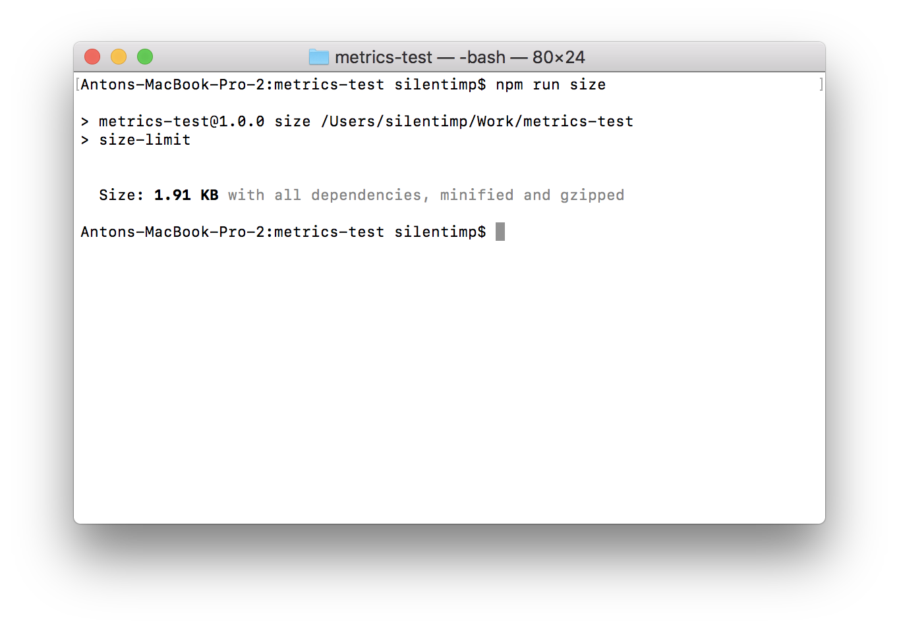
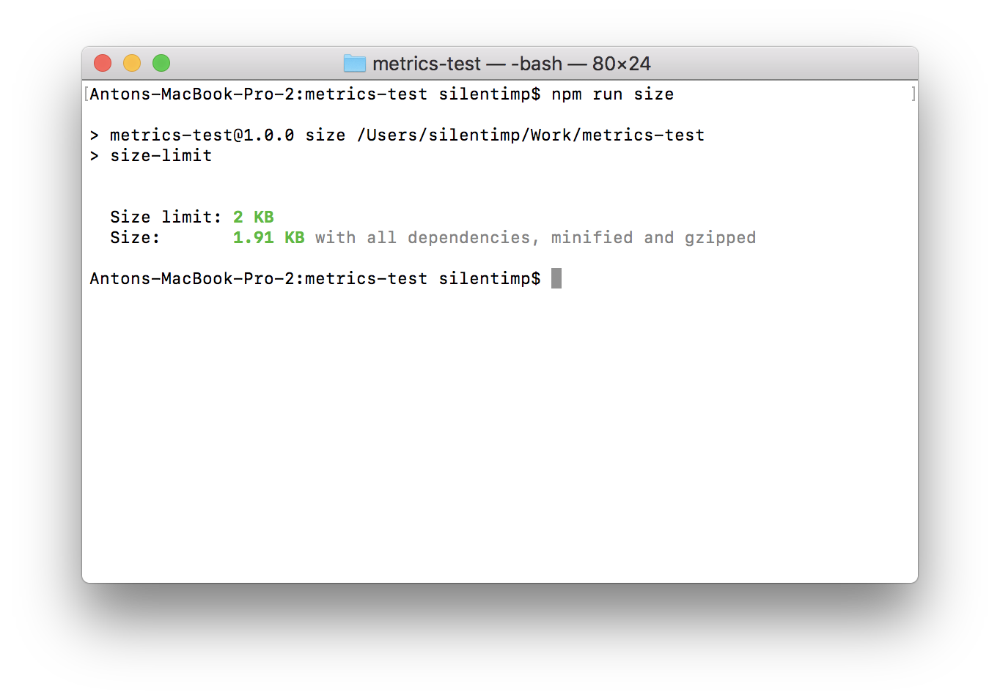
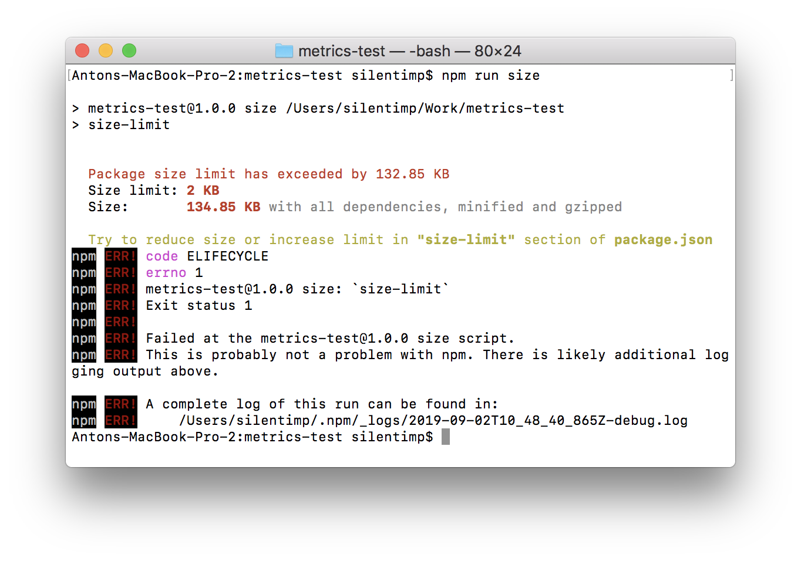
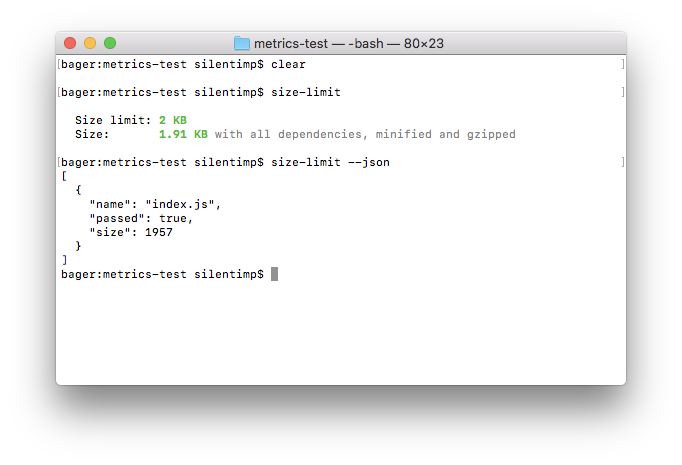
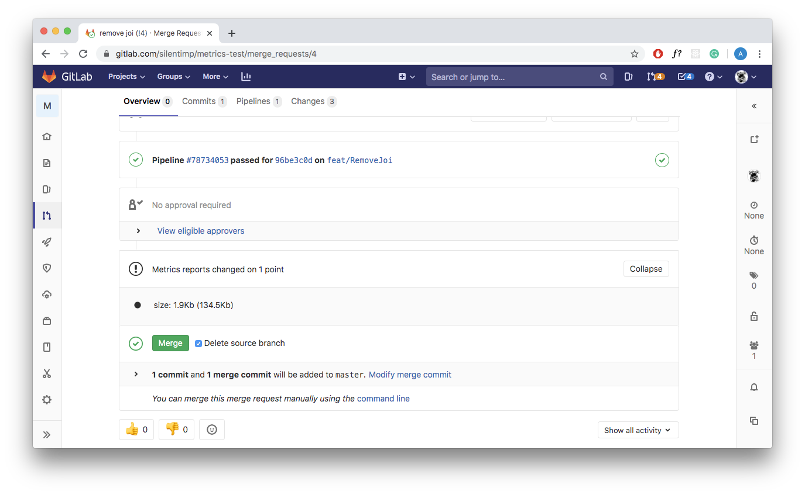
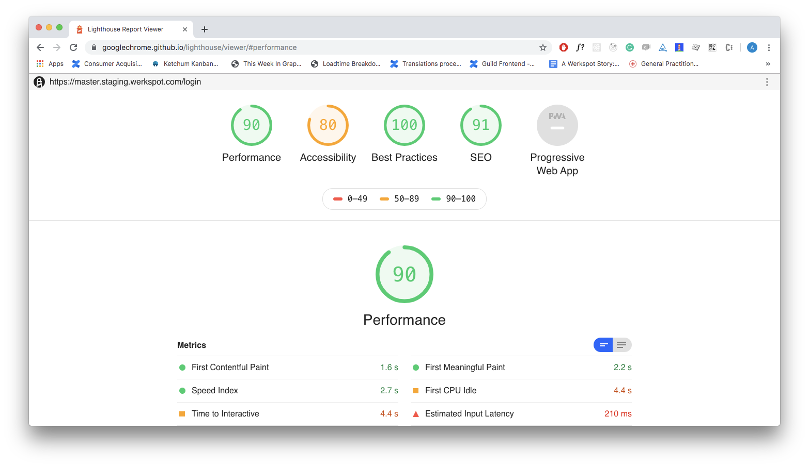
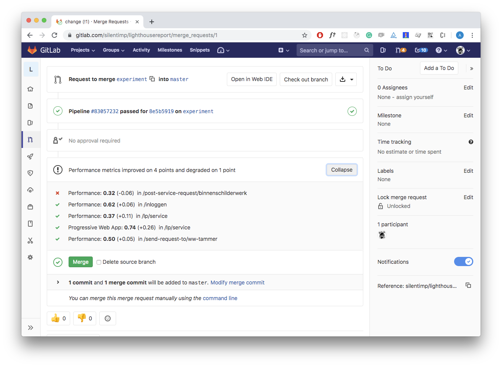
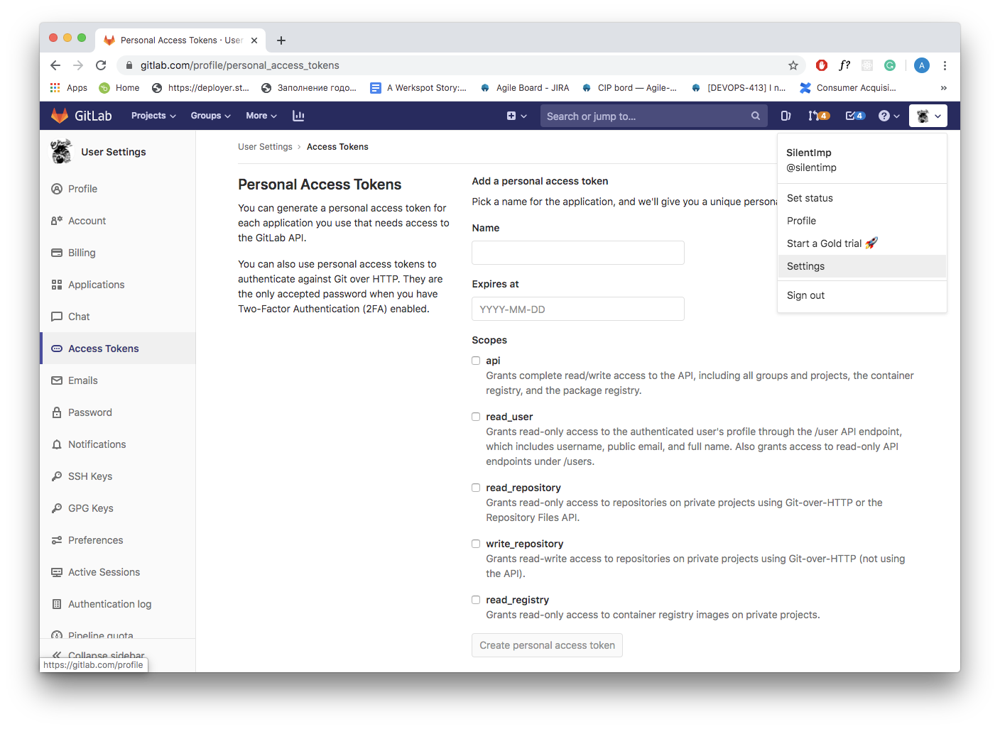
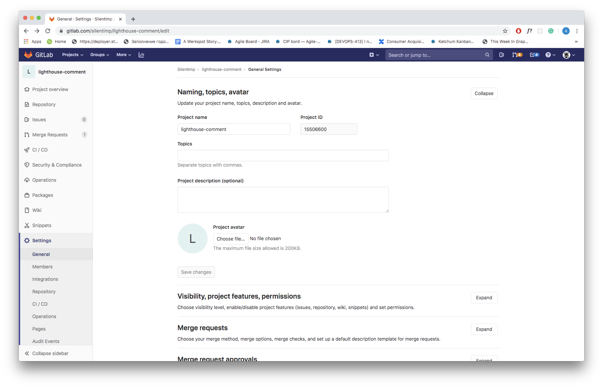
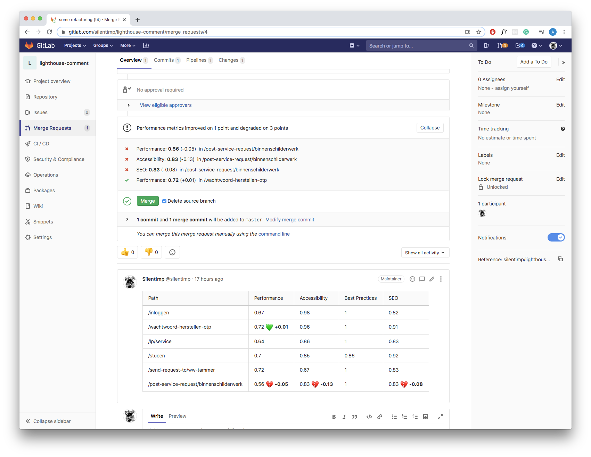

[TOC]

# How to make performance visible with GitLab CI and hoodoo of GitLab artifacts.


We may optimize application so good, that it will start immediately and 60 would be the lowest fps value. But in a month, half a year, ten features, lunar eclipse, seven tuna sandwiches nothing will remind about the performance you were fighting for. Just accept this fact as a sad reality.

So what we should do? Just come to terms with this and drop carrying about performance? It's not a solution. Performance is a competitive advantage that can bring and retain customers. Optimize application from time to time? It's costly. And complex. And that's means that despite all benefits of the performance from a business perspective it's hardly become profitable.

The first step to the solution of any problem — make the problem visible. And I want to discuss exactly that.

## How to create a performance budget for a project

The first question, we should ask: what is the performance project? Which metrics to use? Which values of these metrics are acceptable? The metrics selection is outside of the scope of this article and depends highly on the project context, but I recommend you to start from reading [User-centric Performance Metrics](https://developers.google.com/web/fundamentals/performance/user-centric-performance-metrics) by [Philip Walton](https://developers.google.com/web/resources/contributors/philipwalton).

The easiest way to define desired values for metrics: use your competitors or even yourself. Also, from time to time tooling like https://www.performancebudget.io/ may come in use.

### Use competitors for your benefit

If you ever happened to run away from an ecstatically overexcited bear, then you already know, that you don't need to be Olympic champion in running to get out of this trouble. You just need to be a little bit faster than the other guy.
Make competitors list. If these are projects of the same type, then usually they consist of page types similar to each other. For example, in the internet shop, it may be a page with a product list, product details page, shopping cart, checkout, etc.

1. Measure the values of your selected metrics on each type of page for your competitor's projects.
2. Measure the same metrics on your project.
3. Find the closest better than your value for each metric at the competitor's projects. Adding 20% to them and set as our next goals.

Why 20%? This is a magic number, which, supposedly, should mean that the difference will be noticeable to the bare eye.

### A fight with a shadow

Do you have a unique project? Don't have any competitors? You already better them any of them in all possible senses? It's not an issue. You always can compete with the only worthy opponent — yourself. Measure each performance metric of your project on each type of page and then make them better by the same 20%.

## Synthetic tests

There are two ways of measuring performance: synthetic, in a controlled environment and RUM (real user measurements) when data being collected from real users in production.

We will use synthetic tests and assume that project use GitLab with its build-in CI for project deployment.

### Library and its size as a metric

Let's assume you decided to develop a library and publish it to the NPM. You want to keep it light, much lighter than competitors, so it has less influence on result project end size. And thus save clients traffic, sometimes traffic he paying for. Also, allowing a project to be loaded faster, which is pretty important in light of growing mobile share and new markets with slow connection speed and fragmented internet coverage. 

### Package for measuring library size

To keep size of the library as small as possible we need to watch how it changes. But how to do it? We may use package [Size Limit](https://github.com/ai/size-limit/) created by [Andrey Sitnik](https://sitnik.ru/) from [Evil Martians](https://evilmartians.com/).

Let's install it:

```bash
npm i -D size-limit/preset-small-lib
```

And add to `package.json`

```diff
"scripts": {
+ "size": "size-limit",
  "test": "jest && eslint ."
},
+ "size-limit": [
+   {
+     "path": "index.js"
+   }
+ ],
```

 `"size-limit":[{},{},…]`block contains a list of the files size of which we are willing to check. In our case it's just a one single file — `index.js`

NPM script `size` just run `size-limit` package, which read configuration block `size-limit` that we have mentioned before and check a size of the files, listed there. Let's run it and see what will happen:

```bash
npm run size
```



Now we seeing the size of the file but this size is not actually under control. Let's fix that, add `limit` to `package.json`:

```diff
"size-limit": [
  {
+   "limit": "2 KB",
    "path": "index.js"
  }
],
```

And now, if we will run the script it will be validated against the limit we set.



In case if the file size exceeds limit than the script will be finished with non-zero code. This, aside from other things, means that it will stop the pipeline in the GitLab CI. And we can use it.



Now we can use hooks to check the file size against the limit before every commit … but there always will be `git the hook rebase -i HEAD~1`, which wouldn't run `pre-commit` hook, or, for example `--no-verify` key. And all attempts to prevent an increase in size will be lost in vain.

Also, we shouldn't need to make this check blocking. Why? Because it's ok that the size of the library growing while you are adding new features. We need to make changes visible, that's all. This will help to avoid accidental size increase because of the library that we don't need. And, perhaps, give developers and product owner reason to think if this feature worse it? Or, maybe, if there are smaller packages? https://bundlephobia.com/ allows as to find an alternative to almost anything. 

So what we should do? Let's show the change in the file size directly in the merge request! You don't push to the master directly, you act like a grown-up developer, are you?

#### How to run check inside the GitLab CI

Let's add [GitLab artifact](https://docs.gitlab.com/ee/ci/yaml/README.html#artifacts) of the [metrics](https://docs.gitlab.com/ee/ci/yaml/README.html#artifactsreportsmetrics-premium) type. An artifact is a file, which will «live» after the pipeline operation is finished. This specific type of artifact allows us to show the additional widget in the merge request, this widget will show how to change the value of the metric between artifact in the master and in the feature branch. Format of the `metrics` artifact is a [text Prometheus format](https://prometheus.io/docs/instrumenting/exposition_formats/). For GitLab values inside of the artifact, it's just a text. GitLab doesn't understand how exactly has changed the value, it just knows that value is different. So, what exactly we should do?

1. Define artifacts in the pipeline.
2. Change script in a way it will create an artifact in the pipeline.

To create an artifact we need to change `.gitlab-ci.yml` next way:

```diff
image: node:latest

stages:
  - performance

sizecheck:
  stage: performance
  before_script:
    - npm ci
  script:
    - npm run size
+  artifacts:
+    expire_in: 7 days
+    paths:
+      - metric.txt
+    reports:
+      metrics: metric.txt
```
1. `expire_in: 7 days` — artifact will exist for 7 days.

2. ```yaml
   paths:
     - metric.txt
   ```
   It will be saved in the root catalog. If you will skip this option then it wouldn't be possible to download it.

3. ```yaml
   reports:
     metrics: metric.txt
   ```

   The artifact will have type `reports:metrics`

Now let's make Size Limit to generate a report. To do so we need to change `package.json`:

```diff
"scripts": {
-  "size": "size-limit",
+  "size": "size-limit --json > size-limit.json",
  "test": "jest && eslint ."
},
```

`size-limit` with key `--JSON` will output data in json format:



And redirection `> size-limit.json` will save JSON into file `size-limit.json`.

Now we need to create artifact out of this. Format boils down to `[metrics name][space][metrics value]`. Let's create the script `generate-metric.js`:

```javascript
const report = require('./size-limit.json');
process.stdout.write(`size ${(report[0].size/1024).toFixed(1)}Kb`);
process.exit(0);
```

And add it to `package.json`:

```diff
"scripts": {
  "size": "size-limit --json > size-limit.json",
+  "postsize": "node generate-metric.js > metric.txt",
  "test": "jest && eslint ."
},
```

Because we have used prefix `post` command `npm run size` will run `size` script first, and then, automatically, execute `postsize` script, which will result in the creation of the `metric.txt` file, our artifact. 

As a result, when we will merge this branch to master, change something and create a new merge request, we will see:



In the widget that appears on the page we, first, see the name of the metric — `size`, then the value of the metric in the feature branch and value in the master in the round brackets.

Now we actually see how to change the size of the package and can make a reasonable decision should we merge it or not.

#### Resume

Ok! We figure out how to handle the trivial case. If you have multiple files, just separate metrics with line breaks. As an alternative for Size Limit, you may consider [bundlesize](https://www.npmjs.com/package/bundlesize). If you are using WebPack, you may get all sizes you need by building with `--profile` and `--json` flags:

```bash
webpack --profile --json > stats.json
```

If you are using next.js, you can, for example, use plugin [@next/bundle-analyzer](https://www.npmjs.com/package/@next/bundle-analyzer).

### Using lighthouse

Lighthouse is a standard de'facto in project analytics. Let's write a script, which will allow us to measure performance, a11y, best practice, and an SEO score.

#### Script to measure all the stuff

To start with we will need to install [lighthouse](https://www.npmjs.com/package/lighthouse) package, which will make measurements, and [puppeteer](https://www.npmjs.com/package/puppeteer), which we will use as a headless-browser.

```bash
npm i -D lighthouse puppeteer
```

Afterward, we should create `lighthouse.js` script and start a browser:

```javascript
const puppeteer = require('puppeteer');

(async () => {
  const browser = await puppeteer.launch({
    args: ['--no-sandbox', '--disable-setuid-sandbox', '--headless'],
  });
})();
```

Now let us write a function that will help us to analyze the specific url:

```javascript
const lighthouse = require('lighthouse');

const DOMAIN = process.env.DOMAIN;

const buildReport = browser => async url => {
  const data = await lighthouse(
    `${DOMAIN}${url}`,
    {
      port: new URL(browser.wsEndpoint()).port,
      output: 'json',
    },
    {
      extends: 'lighthouse:full',
    }
  );
  const { report: reportJSON } = data;
  const report = JSON.parse(reportJSON);
  // …
}
```

Great, now we have a function, that will accept browser object as an argument and return a function that will accept `URL` as an argument and,  generate a report after passing that `URL` to the `lighthouse`. Arguments that we are passing to the `lighthouse`:

1. The address we want to analyze.
2. `lighthouse` options, browser `port` in particular, and `output` — output format of the report.
3. `report` configuration. `lighthouse:full` — all we can measure. To more precise configuration check the [documentation](https://github.com/GoogleChrome/lighthouse/blob/master/docs/configuration.md).

Wonderful, we have our report. But what we can do with it? We can check the metrics against the limits and exit script with non zero code which will stop the pipeline: 

```javascript
if (report.categories.performance.score < 0.8) process.exit(1);
```

But we just want to make performance visible and non-blocking? That let's adopt another artifact type: [GitLab performance artifact](https://docs.gitlab.com/ee/ci/yam
l/README.html#artifactsreportsperformance-premium).

#### GitLab performance artifact

This artifacts format … oh, to understand it I have to read code of the [sitespeed.io](https://gitlab.com/gitlab-org/gl-performance) plugin. Why GitLab can't describe the format of their artifacts inside their documentation? Mistery. 

```json
[
  {
        "subject":"/",
    "metrics":[
      {
        "name":"Transfer Size (KB)",
        "value":"19.5",
        "desiredSize":"smaller"
      },
      {
        "name":"Total Score",
        "value":92,
        "desiredSize":"larger"
      },
      {…}
    ]
    },
  {…}
]
```

An artifact is a `JSON` file, which contains an array of the objects, each of them represents a report about one `URL`.

```json
[{page 1}, {page 2}, …]
```

Each page represented by an object with the next attributes:

1. `subject` — page identifier, it's quite handy to use pathname as such.
2. `metrics` — an array of the objects, each of them represents one measurement, that was made on the page.

```json
{
  "subject":"/login/",
  "metrics":[{measurement 1}, {measurement 2}, {measurement 3}, …]
}
```

A measurement is an object, that contains attributes:

1. `name` — measurement name. For example, it may be `Time to first byte` or `Time to interactive`.
2. `value` — numeric measurement result.
3. `desiredSize` — if target value should be as small as possible, like, for example, for `Time to interactive` metric, then the value should be `smaller`, if as large as possible, like, for example, for lighthouse `Performance score` — `larger`.

```json
{
  "name":"Time to first byte (ms)",
  "value":240,
  "desiredSize":"smaller"
}
```

Let's modify our `buildReport` function in a way it returns a report for one page with standard lighthouse metrics.



```javascript
const buildReport = browser => async url => {
  // …
  
  const metrics = [
    {
      name: report.categories.performance.title,
      value: report.categories.performance.score,
      desiredSize: 'larger',
    },
    {
      name: report.categories.accessibility.title,
      value: report.categories.accessibility.score,
      desiredSize: 'larger',
    },
    {
      name: report.categories['best-practices'].title,
      value: report.categories['best-practices'].score,
      desiredSize: 'larger',
    },
    {
      name: report.categories.seo.title,
      value: report.categories.seo.score,
      desiredSize: 'larger',
    },
    {
      name: report.categories.pwa.title,
      value: report.categories.pwa.score,
      desiredSize: 'larger',
    },
  ];
  return {
    subject: url,
    metrics: metrics,
  };
}
```

Now, when we have a function, that generates a report, — let's apply it to each type of the pages of the project. I need to state, that `process.env.DOMAIN` should contain a staging domain, to which you beforehand deploy your project from a feature branch.

```javascript
const fs = require('fs');
const lighthouse = require('lighthouse');
const puppeteer = require('puppeteer');

const DOMAIN = process.env.DOMAIN;

const buildReport = browser => async url => {
  //…
};

const urls = [
  '/inloggen',
  '/wachtwoord-herstellen-otp',
  '/lp/service',
  '/send-request-to/ww-tammer',
  '/post-service-request/binnenschilderwerk',
];

(async () => {
  const browser = await puppeteer.launch({
    args: ['--no-sandbox', '--disable-setuid-sandbox', '--headless'],
  });
  const builder = buildReport(browser);
  const report = [];
  for (let url of urls) {
    const metrics = await builder(url);
    report.push(metrics);
  }
  fs.writeFileSync(`./performance.json`, JSON.stringify(report));
  await browser.close();
})();
```

At that point, perhaps, you want to interrupt me and scream in vain: „—Why are you taking our time, bastard?! You, while can't even use `Promise.all` properly, are trying to teach us something?‟. In my defense, I dare say, that it's [not recommended]((https://github.com/GoogleChrome/lighthouse/issues/7187#issuecomment-461838128)) to run more than one lighthouse instance at the same time, 
in view of the fact that this adversely affects the accuracy of the measurement results, and if you do not show due ingenuity, it will lead to an exception.

#### Use of multiple processes

You still into parallel measurements? Fine, you may use [`node cluster`](https://nodejs.org/docs/latest/api/cluster.html), but it makes sense to discuss it only in the case when your pipeline running on the environment with multiple available cors. And even then you should have in mind that because of the node.js nature you will have full-weight node.js instance spawned in each process fork, instead of reusing the same one, which will lead to growing RAM consumption. All this means that it will be more costly because of the growing hardware requirement and a little bit faster. It may appear that the game is not worth the candle. If you want to take that risk, you will need to:

1. Split URL array to chunks by cores number.
2. Create a fork of a process according to the number of the cores.
3. Transfer parts of the array to the forks and then retrieve generated reports. 

To split an array you may use multpile approaches, and this, writen in couple of minutes wouldn't be any worse than the others:

```javascript 
/**
 * Returns urls array splited to chunks accordin to cors number
 *
 * @param urls {String[]} — URLs array
 * @param cors {Number} — count of available cors
 * @return {Array<String[]>} — URLs array splited to chunks
 */
function chunkArray(urls, cors){
    const arrayLength = urls.length;
    const chunkSize = arrayLength/cors;
    const resultLength = arrayLength < cors ? arrayLength : cors;
      const size = (chunkSize < 1) ? 1 : chunkSize;
    return [...(new Array(resultLength))].map((item, index)=>urls.slice(index, index+size));
}
```

Make forks according to cores count:

```javascript
const fs = require('fs');
const lighthouse = require('lighthouse');
const puppeteer = require('puppeteer');

// Adding packages that allow us to use cluster
const cluster = require('cluster');
// And find out how many cors are available. Both packages are standard for node.js.
const numCPUs = require('os').cpus().length;

const DOMAIN = process.env.DOMAIN;

const buildReport = browser => async url => {
  //…
};

function chunkArray(myArray, chunk_size){
  //…
};

const urls = [
  '/inloggen',
  '/wachtwoord-herstellen-otp',
  '/lp/service',
  '/send-request-to/ww-tammer',
  '/post-service-request/binnenschilderwerk',
];

(async () => {
  if (cluster.isMaster) {
    // Parent process
    const chunks = chunkArray(urls, urls.length/numCPUs);
    chunks.map(chunk => {
      // Creting child processes
      const worker = cluster.fork();
    });
  } else {
    // Child process
  }
})();
```
Lets transfer an array chunks to child processes and retrive reports back:

```javascript
const fs = require('fs');
const lighthouse = require('lighthouse');
const puppeteer = require('puppeteer');

const cluster = require('cluster');
const numCPUs = require('os').cpus().length;

const DOMAIN = process.env.DOMAIN;

const buildReport = browser => async url => {
  //…
};

function chunkArray(myArray, chunk_size){
  //…
};

const urls = [
  '/inloggen',
  '/wachtwoord-herstellen-otp',
  '/lp/service',
  '/send-request-to/ww-tammer',
  '/post-service-request/binnenschilderwerk',
];

(async () => {
  if (cluster.isMaster) {
    // Parent process
    const chunks = chunkArray(urls, urls.length/numCPUs);
    chunks.map(chunk => {
      const worker = cluster.fork();
      // Send message with URL's array to child process
      worker.send(chank);
    });
  } else {
    // Child process
    // Recieveing message from parent proccess
    process.on('message', async (urls) => {
      const browser = await puppeteer.launch({
        args: ['--no-sandbox', '--disable-setuid-sandbox', '--headless'],
      });
      const builder = buildReport(browser);
      const report = [];
      for (let url of urls) {
        // Generating report for each URL
        const metrics = await builder(url);
        report.push(metrics);
      }
      // Send array of reports back to the parent proccess
      cluster.worker.send(report);
      await browser.close();
    });
  }
})();
```

And, finally, reassemble reports to one array and generate an artifact.

```javascript
const fs = require('fs');
const lighthouse = require('lighthouse');
const puppeteer = require('puppeteer');

const cluster = require('cluster');
const numCPUs = require('os').cpus().length;

const DOMAIN = process.env.DOMAIN;

const buildReport = browser => async url => {
  //…
};

function chunkArray(myArray, chunk_size){
  //…
};

const urls = [
  '/inloggen',
  '/wachtwoord-herstellen-otp',
  '/lp/service',
  '/send-request-to/ww-tammer',
  '/post-service-request/binnenschilderwerk',
];

(async () => {
  if (cluster.isMaster) {
    // Parent proccess
    const chunks = chunkArray(urls, urls.length/numCPUs);
    chunks.map(chunk => {
      const worker = cluster.fork();
      worker.send(chank);
    });
    cluster.on('message', (worker, msg) => {
      report = [...report, ...msg];
      worker.disconnect();
      reportsCount++;
      if (reportsCount === chunks.length) {
        console.log('final report: ', report);
        fs.writeFileSync(`./performance.json`, JSON.stringify(report));
        process.exit(0);
      }
    });
  } else {
    // Child process
    process.on('message', async (urls) => {
      const browser = await puppeteer.launch({
        args: ['--no-sandbox', '--disable-setuid-sandbox', '--headless'],
      });
      const builder = buildReport(browser);
      const report = [];
      for (let url of urls) {
        const metrics = await builder(url);
        report.push(metrics);
      }
      cluster.worker.send(report);
      await browser.close();
    });
  }
})();
```

#### Accuracy of measurements

Well, we parallelized the measurements, which increased the already unfortunate large measurement error of the `lighthouse`. How do we reduce it? Make a few measurements and calculate the average.

```javascript
const fs = require('fs');
const lighthouse = require('lighthouse');
const puppeteer = require('puppeteer');

const cluster = require('cluster');
const numCPUs = require('os').cpus().length;

const DOMAIN = process.env.DOMAIN;

const buildReport = browser => async url => {
  //…
};

function chunkArray(myArray, chunk_size){
  //…
};

const urls = [
  '/inloggen',
  '/wachtwoord-herstellen-otp',
  '/lp/service',
  '/send-request-to/ww-tammer',
  '/post-service-request/binnenschilderwerk',
];

// Count of measurements we want to make
const MEASURES_COUNT = 3;

/**
 * Reducer which will calculate an avarage value of all page measurements
 * @param pages {Object} — accumulator
 * @param page {Object} — page
 * @param page {Object} — page with avarage metrics values
 */
const mergeMetrics = (pages, page) => {
  if (!pages) return page;
  return {
    subject: pages.subject,
    metrics: pages.metrics.map((measure, index) => {
      let value = (measure.value + page.metrics[index].value)/2;
      value = +value.toFixed(2);
      return {
        ...measure,
        value,
      }
    }),
  }
}

(async () => {
  if (cluster.isMaster) {
    const arrays = chunkArray(urls, urls.length/numCPUs);
    let report = [];
    let reportsCount = 0;
    arrays.map(chank => {
      const worker = cluster.fork();
      worker.send(chank);
    });
    cluster.on('message', (worker, msg) => {
      report = [...report, ...msg];
      worker.disconnect();
      reportsCount++;
      if (reportsCount === arrays.length) {
        fs.writeFileSync(`./performance.json`, JSON.stringify(report));
        process.exit(0);
      }
    })
  } else {
    process.on('message', async (urls) => {
      const browser = await puppeteer.launch({
        args: ['--no-sandbox', '--disable-setuid-sandbox', '--headless'],
      });
      const builder = buildReport(browser);
      const report = [];
      for (let url of urls) {
        // Let's measure MEASURES_COUNT times and calculate the avarage
        let measures = [];
        let index = MEASURES_COUNT;
        while(index--){
          const metric = await builder(url);
          measures.push(metric);
        }
        const measure = measures.reduce(mergeMetrics);
        report.push(measure);
      }
      cluster.worker.send(report);
      await browser.close();
    });
  }
})();
```

And now we can add `lighthouse` into pipeline.

#### Adding it to the pipeline

Create configuration file `.gitlab-ci.yml`.

```yaml
image: node:latest

stages:
    # You need to deploy a project to staging and put the staging domain name into the environment variable DOMAIN. But this is beyond the scope of this article, primarily because it is very dependent on your specific project.
    # - deploy
    - performance
    
lighthouse:
    stage: performance
  before_script:
    - apt-get update
    - apt-get -y install gconf-service libasound2 libatk1.0-0 libatk-bridge2.0-0 libc6 libcairo2 libcups2 libdbus-1-3 libexpat1 libfontconfig1 libgcc1 libgconf-2-4 libgdk-pixbuf2.0-0 libglib2.0-0 libgtk-3-0 libnspr4 libpango-1.0-0 libpangocairo-1.0-0 libstdc++6 libx11-6 libx11-xcb1 libxcb1 libxcomposite1 libxcursor1 libxdamage1 libxext6 libxfixes3 libxi6 libxrandr2 libxrender1 libxss1 libxtst6 ca-certificates fonts-liberation libappindicator1 libnss3 lsb-release xdg-utils wget
    - npm ci
  script:
      - node lighthouse.js
    artifacts:
    expire_in: 7 days
    paths:
        - performance.json
    reports:
        performance: performance.json
```

Multiple packages, which we install, are needed for the ``puppeteer``. As an alternative, you may consider using `docker`. Aside from that, it makes sense to the fact that we set the type of artifact as performance. And, as soon as both, master and feature branch will have it, you will see widget like this in the merge request:



Nice?

#### Resume

We are finally done with a more complex case. Obviously, there are multiple similar tools aside from the lighthouse. For example https://www.sitespeed.io/. GitLab documentation even contains an [article that explains how to use `sitespeed` in the GitLab's pipeline](https://docs.gitlab.com/ee/user/project/merge_requests/browser_performance_testing.html#configuring-browser-performance-testing), also there is a [plugin for GitLab, which allow us to generate and artifact](https://gitlab.com/gitlab-org/gl-performance). But who would prefer community-driven open-source products to the one owned by corporate monster? 

### Ain't No Rest For The Wicked

And it would seem that we finally there, but no, not really. If you are using paid GitLab version, then artifacts with report types `metrics` and `performance` are present in the plans starting from `premium` and `silver`, which will cost $19 per month for each user, which is quite pricy. And you can't just buy a specific feature you need, only change the plan. Sorry. So what we can do? In distinction from GitHub with it's [Checks API](https://developer.github.com/v3/checks/) and [Status API](https://developer.github.com/v3/repos/statuses/) GitLab wouldn't allow you to create an actual widget in the merge request yourself. And there is [no hope to get them any time soon](https://twitter.com/xanf_ua/status/1196781018948259840):


How to check if you actually have support for this features or not: you may check environment variable `GITLAB_FEATURES` in the pipeline. If it will lack `merge_request_performance_metrics` and `metrics_reports` in the list, then this features are not supported:

```
GITLAB_FEATURES=audit_events,burndown_charts,code_owners,contribution_analytics,elastic_search,export_issues,group_bulk_edit,group_burndown_charts,group_webhooks,issuable_default_templates,issue_board_focus_mode,issue_weights,jenkins_integration,ldap_group_sync,member_lock,merge_request_approvers,multiple_issue_assignees,multiple_ldap_servers,multiple_merge_request_assignees,protected_refs_for_users,push_rules,related_issues,repository_mirrors,repository_size_limit,scoped_issue_board,usage_quotas,visual_review_app,wip_limits
```

If there is no support, we need to come up with something: for example, we may add a comment to the merge request, comment with the table, containing all the data we need. We can leave our code untouched — artifacts will be created, but widgets will always show a message «metrics are unchanged». 
Very strange and non-obvious behavior, I had to think carefully to understand what was happening.

So, what's the plan?

1. We need to read artifact from the `master` branch/
2. Create a comment in the `markdown` format.
3. Get the identifier of the merge request from the current feature branch to the master.
4. Add the comment.

#### How to read artifact from the master branch

If we want to show how performance metrics are changed between `master` and feature branches, we need to [read artifact](https://docs.gitlab.com/ee/api/jobs.html#get-job-artifacts) from the `master`.

```javascript
// GitLab domain
const GITLAB_DOMAIN = process.env.GITLAB_DOMAIN || 'gitlab.com';
// User or organization name
const NAME_SPACE = process.env.NAME_SPACE || 'silentimp';
// Repo name
const PROJECT = process.env.PROJECT || 'lighthouse-comment';
// Name of the job, which create an artifact
const JOB_NAME = process.env.JOB_NAME || 'lighthouse';

/**
 * Returns an artifact
 *
 * @param name {String} artifact file name
 * @return {Object} object with performance artifact
 * @throw {Error} thhrow an error, if artifact contain string, that can't be parsed as a JSON. Or in case of fetch errors.
 */
const getArtifact = async name => {
  const response = await fetch(`https://${GITLAB_DOMAIN}/${NAME_SPACE}/${PROJECT}/-/jobs/artifacts/master/raw/${name}?job=${JOB_NAME}`);
  if (!response.ok) throw new Error('Artifact not found');
  const data = await response.json();
  return data;
};
```

#### Creating a comment text

We need to build comment text in the `markdown` format. Let's create some service funcions, that will help us:

```javascript
/**
 * Return part of report for specific page
 * 
 * @param report {Object} — report
 * @param subject {String} — subject, that allow find specific page
 * @return {Object} — page report
 */
const getPage = (report, subject) => report.find(item => (item.subject === subject));

/**
 * Return specific metric for the page
 * 
 * @param page {Object} — page
 * @param name {String} — metrics name
 * @return {Object} — metric
 */
const getMetric = (page, name) => page.metrics.find(item => item.name === name);

/**
 * Return table cell for desired metric
 * 
 * @param branch {Object} - report from feature branch
 * @param master {Object} - report from master branch
 * @param name {String} - metrics name
 */
const buildCell = (branch, master, name) => {
  const branchMetric = getMetric(branch, name);
  const masterMetric = getMetric(master, name);
  const branchValue = branchMetric.value;
  const masterValue = masterMetric.value;
  const desiredLarger = branchMetric.desiredSize === 'larger';
  const isChanged = branchValue !== masterValue;
  const larger = branchValue > masterValue;
  if (!isChanged) return `${branchValue}`;
  if (larger) return `${branchValue} ${desiredLarger ? '💚' : '💔' }&nbsp;**+${Math.abs(branchValue - masterValue).toFixed(2)}**`;
  return `${branchValue} ${!desiredLarger ? '💚' : '💔' }&nbsp;**-${Math.abs(branchValue - masterValue).toFixed(2)}**`;
};

/**
 * Returns text of the comment with table inside
 * This table contain changes in all metrics
 *
 * @param branch {Object} report from feature branch
 * @param master {Object} report from master branch
 * @return {String} comment markdown
 */
const buildCommentText = (branch, master) =>{
  const md = branch.map( page => {
    const pageAtMaster = getPage(master, page.subject);
    if (!pageAtMaster) return '';
    const md = `|${page.subject}|${buildCell(page, pageAtMaster, 'Performance')}|${buildCell(page, pageAtMaster, 'Accessibility')}|${buildCell(page, pageAtMaster, 'Best Practices')}|${buildCell(page, pageAtMaster, 'SEO')}|
`;
    return md;
  }).join('');
  return `
|Path|Performance|Accessibility|Best Practices|SEO|
|--- |--- |--- |--- |--- |
${md}
`;
};
```

#### Script which will build a comment

You will need to have a token to work with GitLab API. To generate one you need to open GitLab, login, open the `Settings` option of the menu and on the page that will be opened in the left navigation menu you should open `Access Tokens`. You should now see the form, which allows you to generate the token.



Also, you will need an ID of the project. You can find it in the repository  `Settings` in the submenu `General` :



To add a comment to the merge request we need to know it's id. [Function that allows you to acquire merge request id](https://docs.gitlab.com/ee/api/merge_requests.html#get-single-mr) looks like this:

```javascript
// ID of the project
const GITLAB_PROJECT_ID = …;
// Token 
const TOKEN = …;

/**
 * Returns iid of the merge request from feature branch to master
 * @param from {String} — name of the feature branch
 * @param to {String} — name of the master branch
 * @return {Number} — iid of the merge request
 */
const getMRID = async (from, to) => {
    fetch(`https://${GITLAB_DOMAIN}/api/v4/projects/${GITLAB_PROJECT_ID}/merge_requests?target_branch=${to}&source_branch=${from}`, {
    method: 'GET',
    headers: {
      'PRIVATE-TOKEN': TOKEN,
    }
  });
  const [{iid}] = await response.json();
  return iid;
};
```

We need to get feature branch name. You may use envirement variable `CI_COMMIT_REF_SLUG` inside the pipeline. Outside the pipeline you can use `current-git-branch` package. Also you will need to form message body. Let's install packages we need for this matter:

```bash
npm i -S current-git-branch form-data
```

And now, finally, [function to add a comment](https://docs.gitlab.com/ee/api/merge_requests.html#comments-on-merge-requests):

```javascript
const FormData = require('form-data');
const branchName = require('current-git-branch');

// Branch from which we are making merge request
// In the pipeline we have environment variable `CI_COMMIT_REF_SLUG`, 
// which contains name of this banch. Function `branchName` 
// will return something like «HEAD detached» message in the pipeline. 
// And name of the branch outside of pipeline
const CURRENT_BRANCH = process.env.CI_COMMIT_REF_SLUG || branchName();

// Merge request target branch, usually it's master
const DEFAULT_BRANCH = process.env.CI_DEFAULT_BRANCH || 'master';

// ID of the project
const GITLAB_PROJECT_ID = …;
// Token 
const TOKEN = …;

/**
 * Adding comment to merege request
 * @param md {String} — markdown text of the comment
 */
const addComment = async md => {
  const iid = await getMRID(CURRENT_BRANCH, DEFAULT_BRANCH);
  const commentPath = `https://${GITLAB_DOMAIN}/api/v4/projects/${GITLAB_PROJECT_ID}/merge_requests/${iid}/notes`;
  const body = new FormData();
  body.append('body', md);

  await fetch(commentPath, {
    method: 'POST',
    headers: {
      'PRIVATE-TOKEN': TOKEN,
    },
    body,
  });
};

```

And all together now:

```javascript
require('dotenv').config();

const cluster = require('cluster');
const numCPUs = require('os').cpus().length;
const puppeteer = require('puppeteer');
const FormData = require('form-data');
const lighthouse = require('lighthouse');
const branchName = require('current-git-branch');
const fetch = require('isomorphic-fetch');
const fs = require('fs');

const DOMAIN = process.env.DOMAIN || 'https://werkspot.nl';
const GITLAB_DOMAIN = 'gitlab.com';
const NAME_SPACE = 'silentimp';
const PROJECT = 'lighthouse-comment';
const JOB_NAME = 'lighthouse';
const GITLAB_PROJECT_ID = '15506600';
const TOKEN = process.env.GITLAB_TOKEN;

const DEFAULT_BRANCH = process.env.CI_DEFAULT_BRANCH || 'master';
const CURRENT_BRANCH = process.env.CI_COMMIT_REF_SLUG || branchName();

// urls
const urls = [
  '/inloggen',
  '/wachtwoord-herstellen-otp',
  '/lp/service',
  '/stucen',
  '/send-request-to/ww-tammer',
  '/post-service-request/binnenschilderwerk',
];

// build report for single url
const buildReport = browser => async url => {
  const data = await lighthouse(
    `${DOMAIN}${url}`,
    {
      port: new URL(browser.wsEndpoint()).port,
      output: 'json',
    },
    {
      extends: 'lighthouse:full',
    }
  );
  const { report: reportJSON } = data;
  const report = JSON.parse(reportJSON);
  const metrics = [
    {
      name: report.categories.performance.title,
      value: report.categories.performance.score,
      desiredSize: 'larger',
    },
    {
      name: report.categories.accessibility.title,
      value: report.categories.accessibility.score,
      desiredSize: 'larger',
    },
    {
      name: report.categories['best-practices'].title,
      value: report.categories['best-practices'].score,
      desiredSize: 'larger',
    },
    {
      name: report.categories.seo.title,
      value: report.categories.seo.score,
      desiredSize: 'larger',
    },
    {
      name: report.categories.pwa.title,
      value: report.categories.pwa.score,
      desiredSize: 'larger',
    },
  ];
  return {
    subject: url,
    metrics: metrics,
  };
};

/**
 * Returns an artifact
 *
 * @param name {String} artifact file name
 * @return {Object} object with performance artifact
 * @throw {Error} thhrow an error, if artifact contain string, that can't be parsed as a JSON. Or in case of fetch errors.
 */
const getArtifact = async name => {
  const response = await fetch(`https://${GITLAB_DOMAIN}/${NAME_SPACE}/${PROJECT}/-/jobs/artifacts/master/raw/${name}?job=${JOB_NAME}`);
  if (!response.ok) throw new Error('Artifact not found');
  const data = await response.json();
  return data;
};

/**
 * Return part of report for specific page
 * 
 * @param report {Object} — report
 * @param subject {String} — subject, that allow find specific page
 * @return {Object} — page report
 */
const getPage = (report, subject) => report.find(item => (item.subject === subject));

/**
 * Return specific metric for the page
 * 
 * @param page {Object} — page
 * @param name {String} — metrics name
 * @return {Object} — metric
 */
const getMetric = (page, name) => page.metrics.find(item => item.name === name);

/**
 * Returns text of the comment with table inside
 * This table contain changes in all metrics
 *
 * @param branch {Object} report from feature branch
 * @param master {Object} report from master branch
 * @return {String} comment markdown
 */
const buildCell = (branch, master, name) => {
  const branchMetric = getMetric(branch, name);
  const masterMetric = getMetric(master, name);
  const branchValue = branchMetric.value;
  const masterValue = masterMetric.value;
  const desiredLarger = branchMetric.desiredSize === 'larger';
  const isChanged = branchValue !== masterValue;
  const larger = branchValue > masterValue;
  if (!isChanged) return `${branchValue}`;
  if (larger) return `${branchValue} ${desiredLarger ? '💚' : '💔' }&nbsp;**+${Math.abs(branchValue - masterValue).toFixed(2)}**`;
  return `${branchValue} ${!desiredLarger ? '💚' : '💔' }&nbsp;**-${Math.abs(branchValue - masterValue).toFixed(2)}**`;
};

/**
 * Returns text of the comment with table inside
 * This table contain changes in all metrics
 *
 * @param branch {Object} report from feature branch
 * @param master {Object} report from master branch
 * @return {String} comment markdown
 */
const buildCommentText = (branch, master) =>{
  const md = branch.map( page => {
    const pageAtMaster = getPage(master, page.subject);
    if (!pageAtMaster) return '';
    const md = `|${page.subject}|${buildCell(page, pageAtMaster, 'Performance')}|${buildCell(page, pageAtMaster, 'Accessibility')}|${buildCell(page, pageAtMaster, 'Best Practices')}|${buildCell(page, pageAtMaster, 'SEO')}|
`;
    return md;
  }).join('');
  return `
|Path|Performance|Accessibility|Best Practices|SEO|
|--- |--- |--- |--- |--- |
${md}
`;
};

/**
 * Returns iid of the merge request from feature branch to master
 * @param from {String} — name of the feature branch
 * @param to {String} — name of the master branch
 * @return {Number} — iid of the merge request
 */
const getMRID = async (from, to) => {
  const MRPath = `https://${GITLAB_DOMAIN}/api/v4/projects/${GITLAB_PROJECT_ID}/merge_requests?target_branch=${to}&source_branch=${from}`;
  const response = await fetch(MRPath, {
    method: 'GET',
    headers: {
      'PRIVATE-TOKEN': TOKEN,
    }
  });
  const [{iid}] = await response.json();
  return iid;
};

/**
 * Adding comment to merege request
 * @param md {String} — markdown text of the comment
 */
const addComment = async md => {
  const iid = await getMRID(CURRENT_BRANCH, DEFAULT_BRANCH);
  const commentPath = `https://${GITLAB_DOMAIN}/api/v4/projects/${GITLAB_PROJECT_ID}/merge_requests/${iid}/notes`;
  const body = new FormData();
  body.append('body', md);

  await fetch(commentPath, {
    method: 'POST',
    headers: {
      'PRIVATE-TOKEN': TOKEN,
    },
    body,
  });
};

/**
 * Returns urls array splited to chunks accordin to cors number
 *
 * @param urls {String[]} — URLs array
 * @param cors {Number} — count of available cors
 * @return {Array<String[]>} — URLs array splited to chunks
 */
function chunkArray(urls, cors){
  const arrayLength = urls.length;
  const chunk_size = arrayLength/cors;
  const resultLength = arrayLength < cors ? arrayLength : cors;
  const size = (chunk_size < 1) ? 1 : chunk_size;
  return [...(new Array(resultLength))].map((item, index)=>urls.slice(index, index+size));
}

// Count of measurements we want to make
const MEASURES_COUNT = 3;

/**
 * Reducer which will calculate an avarage value of all page measurements
 * @param pages {Object} — accumulator
 * @param page {Object} — page
 * @param page {Object} — page with avarage metrics values
 */
const mergeMetrics = (pages, page) => {
  if (!pages) return page;
  return {
    subject: pages.subject,
    metrics: pages.metrics.map((measure, index) => {
      let value = (measure.value + page.metrics[index].value)/2;
      value = +value.toFixed(2);
      return {
        ...measure,
        value,
      }
    }),
  }
}

(async () => {
  if (cluster.isMaster) {
    const chunks = chunkArray(urls, numCPUs);
    let report = [];
    let reportsCount = 0;

    chunks.map(chunk => {
      const worker = cluster.fork();
      worker.send(chunk);
    });
    cluster.on('message', async (worker, msg) => {
      report = [...report, ...msg];
      worker.disconnect();
      reportsCount++;
      if (reportsCount === chunks.length) {
        fs.writeFileSync(`./performance.json`, JSON.stringify(report));

        try {
          const masterReport = await getArtifact('performance.json');
          const md = buildCommentText(report, masterReport)
          await addComment(md);
        } catch (error) {
          console.log(error);
        }

        process.exit(0);
      }
    });
    
  } else {
    process.on('message', async (urls) => {
      const browser = await puppeteer.launch({
        args: ['--no-sandbox', '--disable-setuid-sandbox', '--headless'],
      });
      const builder = buildReport(browser);
      const report = [];
      for (let url of urls) {
        let measures = [];
        let index = MEASURES_COUNT;
        while(index--){
          const metric = await builder(url);
          measures.push(metric);
        }
        const measure = measures.reduce(mergeMetrics);
        report.push(measure);
      }
      cluster.worker.send(report);
      await browser.close();
    });
  }

})();
```

Now create merge request and you will get:



#### Resume

Comment much less visible than widget but it's still much better than nothing. This way we can visualize the performance even without atifacts.

#### Authentication 

Ok, but what about authentication? Performance of the pages, that require authentication, is also important. It's easy, we will simply login. `puppeteer` is essentially a fully-fledged browser and we can write scripts that mimic user actions:

```javascript
const LOGIN_URL = '/login';
const USER_EMAIL = process.env.USER_EMAIL;
const USER_PASSWORD = process.env.USER_PASSWORD;

/**
 * Authentication sctipt
 * @param browser {Object} — browser instance
 */
const login = async browser => {
  const page = await browser.newPage();
  page.setCacheEnabled(false);
  await page.goto(`${DOMAIN}${LOGIN_URL}`, { waitUntil: 'networkidle2' });
  await page.click('input[name=email]');
  await page.keyboard.type(USER_EMAIL);
  await page.click('input[name=password]');
  await page.keyboard.type(USER_PASSWORD);
  await page.click('button[data-testid="submit"]', { waitUntil: 'domcontentloaded' });
};
```

Before checking a page, which require authentication, we may just run this script. Done.

## Summary

Now you know how to visualize performance change, this will help better track performance degradation. What's comes next? You may save the data and visualize it for time period, to better understand big picture. You may collect performance data directly from the users. You may check great talk on this subject: [Measuring Real User Performance in the Browser](https://www.youtube.com/watch?v=yrWLi524YLM). When you will bild the system that will collect performance data and visualize them — it will help to find you performance bottlenecks and resolve them. Good luck with that.
